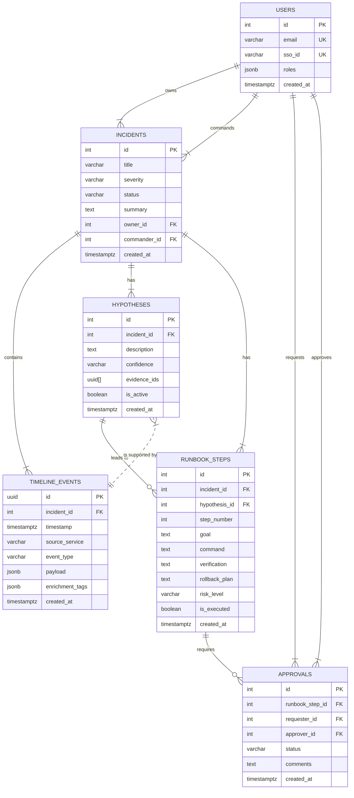
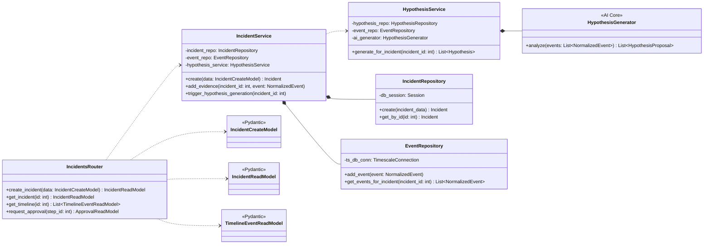
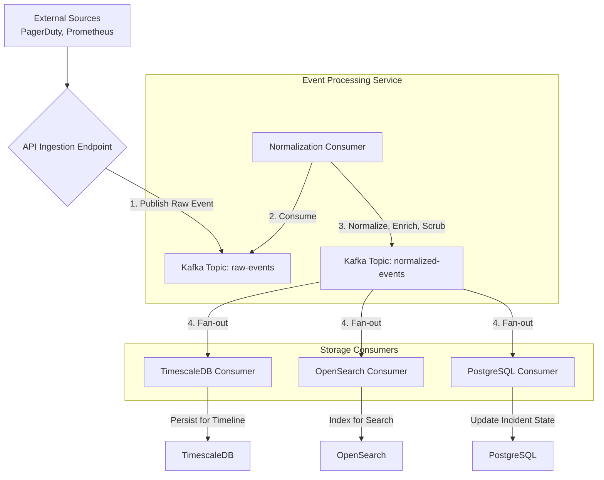

# Project

## Product Specification

### Introduction & Vision
This document outlines the requirements for the On\-Call AI Agent, a system designed to function as a safety net during critical incidents and a proactive coach for system reliability\. The vision is to create a tool that reduces downtime, accelerates fixes, and enables the system to learn and improve over time\.During an outage, the agent acts as an instant\-on incident investigator\. It intelligently filters signals from noise, forms hypotheses based on evidence, guides engineers with clear, safe remediation steps, and documents the entire process\. After an incident, the agent shifts to a proactive mode, analyzing trends across metrics, events, logs, and traces \(MELT\) to identify patterns and suggest preventative changes, thereby stopping future outages before they occur\. The core goal is to decrease mean time to repair \(MTTR\), minimize the operational and financial cost of downtime, and create a continuously improving, more resilient system\.### Target Audience & User Personas
The system is designed for several key roles within an organization, each with distinct needs and motivations\.#### On\-Call Engineer
**Description:** A Site Reliability Engineer \(SRE\), platform engineer, or on\-call developer who is the first responder to production incidents\. They are often working under pressure, at odd hours, and need to solve problems quickly and safely\.

**Goals:**

To rapidly understand the context of an alert without sifting through irrelevant data\.

To receive clear, actionable guidance on how to diagnose and resolve an issue\.

To execute remediation steps with confidence that they are safe and approved\.

To avoid manual, repetitive work like documenting timelines and writing post\-incident reports\.

#### Incident Commander
**Description:** The individual responsible for leading the response to a high\-severity incident\. They coordinate efforts, make critical decisions, and ensure the right people are involved\.

**Goals:**

To maintain a clear, real\-time overview of the incident status, actions taken, and current hypotheses\.

To approve or reject high\-risk actions quickly and with sufficient context\.

To delegate tasks and manage team communication effectively within the incident workspace\.

To ensure a clean, accurate record of the incident is available for review\.

#### Manager
**Description:** An engineering manager or director responsible for the reliability of one or more services\. They are concerned with team performance, operational costs, and overall system health\.

**Goals:**

To gain visibility into incident response performance and track metrics like MTTR\.

To understand the root causes of incidents and the effectiveness of preventative measures\.

To review incident reports and team actions without needing to be directly involved in every incident\.

#### Executive
**Description:** A C\-level stakeholder who is concerned with the business impact of system reliability, including revenue loss from downtime, customer trust, and regulatory compliance\.

**Goals:**

To understand the high\-level health of the system and the business cost of downtime\.

To see measurable improvements in reliability and incident response efficiency over time\.

To receive concise, high\-level summaries of prevented incidents and key learnings\.

#### Auditor
**Description:** A compliance or security professional responsible for ensuring that incident response practices adhere to internal policies and external regulations \(e\.g\., SOC2\)\.

**Goals:**

To access a complete, immutable log of all actions, decisions, and approvals made during an incident\.

To easily export incident reports and timelines for audit purposes\.

To verify that security and access control policies were enforced correctly\.

### User Stories / Use Cases
#### Reactive Incident Response
As an On\-Call Engineer, I want the system to automatically ingest an alert from PagerDuty and create an incident workspace, so I can immediately start diagnosis without manual setup\.

As an On\-Call Engineer, I want the workspace to automatically pull in only the relevant metrics, logs, events, and traces based on a service dependency graph, so I don't get overwhelmed by irrelevant data from other services\.

As an On\-Call Engineer, I want the AI agent to propose a high\-confidence root cause hypothesis with supporting evidence, so I have a clear starting point for my investigation\.

As an On\-Call Engineer, I want to be able to run safe, pre\-defined validation steps to confirm or deny a hypothesis, so I can build confidence in the diagnosis before taking action\.

As an Incident Commander, I want to review and approve proposed remediation steps that are labeled as high\-risk, so I can ensure changes to production are made safely and according to policy\.

As an On\-Call Engineer, I want to follow a clear, step\-by\-step runbook provided by the agent, so I know the correct sequence of actions to resolve the incident\.

As an On\-Call Engineer, I want the system to automatically document every action, observation, and approval in a live timeline, so the post\-incident report practically writes itself\.

As a Manager, I want to review a complete, auto\-generated post\-incident report within an hour of resolution, so my team can focus on follow\-up actions instead of paperwork\.

#### Proactive Optimization
As a Platform Engineer, I want the agent to analyze historical performance data and identify services that are trending towards their resource limits, so I can address the issue before it causes an outage\.

As an SRE, I want to receive a short list of actionable suggestions for improving system resilience, so I can prioritize preventative work effectively\.

As an Executive, I want to read a weekly digest that summarizes potential incidents that were avoided, so I can understand the value of our proactive reliability efforts\.

### Functional Requirements
#### Incident Management \(Reactive Mode\)
##### Incident Ingestion & Workspace Creation
The system must be able to receive alerts from an external pager system \(e\.g\., PagerDuty\)\.

Upon receiving an alert, the system must automatically open a new, dedicated incident workspace\.

The workspace must display a high\-level summary bar containing the incident title, severity, current owner, and a one\-sentence status summary generated by the AI agent\.

Users with appropriate permissions must be able to edit the incident severity and owner directly from the summary bar\.

##### Evidence Curation and Display
The system must fetch and display relevant signals \(metrics, events, logs, traces\) based on a live service dependency graph\.

Signals from services not directly related to the incident source must be excluded from the initial view to reduce noise\.

The evidence must be presented in an "Evidence Panel," organized by service or component \(e\.g\., auth service, user DB, recent deploys\)\.

Each piece of evidence must include a plain\-language explanation of why it was included \(e\.g\., "Included because DB connections spiked after deploy \#412"\)\.

Users must be able to manually request additional signals \(e\.g\., "show last 15 minutes of DB IOPS"\) to augment the agent's curated view\.

Any evidence added manually must be attributed to the user who added it, with a timestamp\.

##### Live Timeline
The workspace must feature a central, live\-updating timeline that chronicles the incident\.

The timeline must read chronologically, like a narrative, capturing key events such as:

Alert firing

Agent actions \(e\.g\., "Agent checked DB connections"\)

Key findings \(e\.g\., "Disk at 100%"\)

Human actions, approvals, and comments\.

Each timeline item must be expandable to show the specific evidence \(log snippets, metric snapshots\) it is based on\.

Clicking a timeline item must filter the other panels in the workspace to show only the context relevant to that moment\.

##### Hypothesis Generation and Validation
The AI agent must analyze the curated evidence and propose one or more potential root cause hypotheses\.

Each hypothesis must be displayed with:

A short, descriptive paragraph\.

A confidence score \(e\.g\., "high confidence"\)\.

A list of the specific pieces of evidence supporting it\.

For each hypothesis, the agent must suggest safe, read\-only validation steps a user can run to verify the idea \(e\.g\., "list top 5 largest files in /var/log"\)\.

The results of any executed validation step must be added to the timeline, and the agent must update its hypothesis confidence score accordingly\.

##### Runbook Generation and Execution
Once a hypothesis is deemed likely, the system must generate a step\-by\-step runbook for remediation\.

The runbook must be presented as an ordered plan in plain English\.

Each step must clearly state:

The goal of the action \(What\)\.

The method or command to perform it \(How\)\.

The expected outcome or success criteria \(Verification\)\.

A clearly stated rollback plan\.

Where safe and possible, the agent should provide pre\-parameterized command snippets that the user can execute\.

##### Human Approval Workflow
All executable actions \(validation steps, runbook steps\) must be labeled with a risk level \(e\.g\., read\-only, low, medium, high\) determined by policy\.

Users must be able to execute read\-only and low\-risk actions directly, provided they have the necessary permissions\.

Medium and high\-risk actions must require explicit approval before they can be executed\.

When a user requests approval, the system must notify the designated approver\(s\) \(e\.g\., Incident Commander\) with the full context of the proposed action, its potential impact, and the rollback plan\.

Approvers must be able to approve, reject, or edit the proposed action\.

All approval decisions, edits, and comments must be captured in the incident timeline\.

The system must provide a "break\-glass" capability for emergencies\.

Using this feature must require the user to provide a justification\.

It must automatically notify a second party\.

The elevated permissions granted must be time\-limited\.

The event must be prominently logged in the timeline for auditing\.

##### Collaboration and Reporting
The workspace must include a collaboration feature allowing users to @mention teammates and pin important findings\.

The system must post key incident updates \(e\.g\., new hypothesis, step approved, incident resolved\) to an external chat system\.

Upon incident resolution, the system must automatically compile the timeline, evidence, and actions into a shareable post\-incident report\.

The report must include the root cause, timeline, impact, actions taken, individuals involved, and approvals granted\.

#### Proactive Optimization \(Secondary MVP Priority\)
The system must analyze historical MELT signals to identify patterns that indicate future risk \(e\.g\., a service's resource usage consistently trending towards its limit\)\.

The system must be able to use the service topology to understand potential ripple effects of a component failure\.

The system must surface a short list of actionable, proactive suggestions to improve reliability\.

TODO: Define the minimum set of proactive recommendations for the MVP\. Options: 1\. Focus on a single, high\-impact pattern like predicting disk/resource exhaustion based on linear trends\. \(Pro: Delivers clear value, simple to implement\. Con: Limited scope\)\. 2\. Implement a basic UI to show performance trends for key services without generating specific AI recommendations\. \(Pro: Provides visibility, lower AI risk\. Con: Less "intelligent," shifts burden to user\)\. 3\. Focus only on post\-incident learning, suggesting new alert thresholds or runbook improvements based on the last resolved incident\. \(Pro: Tightly coupled to core loop, high\-relevance\. Con: Only learns after a failure has already occurred\)\.

#### System Integrations
The system must integrate with Prometheus for metrics and traces\.

The system must integrate with PagerDuty for alert ingestion\.

The system must be able to ingest data from logging platforms and cloud audit trails\.

The system must support integration with enterprise Single Sign\-On \(SSO\) providers using LDAP or SAML for authentication\.

#### Security & Access Control
The system must implement Role\-Based Access Control \(RBAC\) to manage user permissions\.

The following roles and permissions must be supported:

**On\-Call Engineer:** View incidents, run low/medium\-risk actions, request approvals\.

**Incident Commander:** Full incident edit rights, approve high\-risk actions, manage roles, close incidents\.

**Manager:** Read\-only access to all incidents, reports, and metrics\.

**Auditor:** Read\-only access to all incidents and audit logs, with the ability to export reports\.

Roles must be mappable from SSO provider attributes \(e\.g\., user groups\)\.

All actions that change system state or production environments must be recorded in an immutable audit trail\.

The system must be capable of redacting sensitive data \(PII, secrets\) from logs and reports based on defined rules\.

### Non\-Functional Requirements
#### Performance
The system must update the incident timeline within 5 seconds of an event being ingested \(P99 latency\)\.

The user interface must remain responsive during high\-volume incident events, with UI updates for new timeline events having a P95 latency of 3 seconds or less\.

The system must support at least 200 active incidents concurrently, with up to 20 users interacting live within a single incident\.

#### Reliability
The core incident workspace functionality must have an uptime of at least 99\.5% during the MVP phase\.

In the event of a failure in an external connector or an uncertain AI model response, the system must fail safe and request human intervention rather than proceeding with a guess\.

#### Security
User authentication must be handled via enterprise SSO\.

The system must enforce the principle of least privilege for all internal and external integrations\.

All sensitive data, including secrets and credentials for integrations, must be stored securely\.

All data must be encrypted at rest\.

#### Usability
The user interface must be intuitive for a tired, stressed engineer to use at 2 a\.m\.

AI\-generated explanations and reasoning must be presented in clear, human\-readable language, avoiding jargon\.

The path from alert to a proposed runbook must be clear and require minimal clicks\.

#### Compliance
The system must generate immutable audit logs suitable for compliance standards like SOC2\.

The system must support data retention policies to honor regulatory requirements like GDPR\.

### Scope
#### In Scope \(MVP\)
The full end\-to\-end reactive incident investigation workflow, from alert ingestion to post\-incident report generation\.

Integration with PagerDuty for alerts and Prometheus for metrics\.

A functional incident workspace including the timeline, evidence panel, hypothesis generation, and runbook view\.

Human\-in\-the\-loop approval workflows for medium and high\-risk actions\.

RBAC with the four defined user roles \(On\-Call Engineer, Incident Commander, Manager, Auditor\) and SSO integration\.

Foundational capabilities for proactive analysis as a secondary feature\.

#### Out of Scope \(MVP\)
The system will not be a replacement for existing monitoring, logging, or tracing platforms\.

Unsupervised, fully automatic remediation in a production environment\.

The invention of new data signals; the system will only use data from connected tools\.

Perfect prediction of incidents\.

### Success Metrics
The success of the On\-Call AI Agent will be measured by the following KPIs:**Time\-to\-Triage \(T3\):** The median time from an alert firing to the agent generating its first root cause hypothesis will be less than or equal to 2 minutes\.

**Mean Time to Repair \(MTTR\):** A measurable reduction in MTTR for incidents handled with the agent compared to those handled without it\. Target reduction of 25% by the end of the first quarter post\-launch\.

**Hypothesis Accuracy:** At least 80% of the agent's primary suggested root causes are confirmed as correct by the responding engineer\.

**Runbook Success Rate:** At least 90% of agent\-generated runbook steps can be executed without manual modification\.

**Post\-Incident Report Timeliness:** A draft of the post\-incident report is available within 10 minutes of incident resolution\.

**User Adoption & Satisfaction:** At least 75% of on\-call engineers actively use the tool for P1/P2 incidents within two months of launch\. User satisfaction score of at least 4 out of 5 from internal feedback surveys\.

### Assumptions & Dependencies
#### Assumptions
The organization's services have clean, consistent identifiers that can be used for correlation\.

A dependable, machine\-readable source for the service dependency graph is available\.

Incident responders will follow the structured workflow and provide feedback to improve the agent's learning loop\.

#### Dependencies
The system is dependent on access to key telemetry streams from existing observability platforms \(Prometheus, logging platforms\)\.

The system relies on an existing incident management tool \(PagerDuty\) to receive alerts\.

The system's effectiveness is dependent on having a place to run approved actions, whether a CLI, script runner, or workflow engine\.

### Risks and Mitigations
**Risk:** The AI agent provides an incorrect or misleading hypothesis, sending engineers down the wrong path\.

**Mitigation:** The agent must always display its confidence level and the specific evidence used for its reasoning\. All actions are gated by human\-in\-the\-loop validation and approval steps\.

**Risk:** Poor quality or inconsistent data from observability tools leads to poor recommendations\.

**Mitigation:** The system will focus on topology\-aware correlation to filter noise\. Initial rollout will be on a small set of services with well\-instrumented telemetry\.

**Risk:** Engineers do not trust the "black box" and refuse to adopt the tool\.

**Mitigation:** Emphasize explainability at every step\. The "show your work" feature, where every piece of evidence and reasoning is visible, is critical for building trust\.

**Risk:** The approval workflow adds friction and slows down incident response\.

**Mitigation:** The approval process will be deeply integrated into the UI and chat tools for low\-latency responses\. Policies will be configurable to allow on\-call engineers to execute low\-risk actions without approval\.

### Incident Simulation and Testing Strategy
TODO: Finalize the strategy for simulating realistic incident scenarios to validate the end\-to\-end workflow during development\. Options: 1\. Develop a synthetic alert and telemetry generator that can create controlled incident scenarios with predictable data patterns \(e\.g\., CPU spike, disk full\)\. \(Pro: Highly repeatable, good for automated testing\. Con: May not capture the complexity of real\-world failures\)\. 2\. Build a manual test harness that allows engineers to trigger specific alerts and manually inject evidence into the system to test UI and logic flows\. \(Pro: Flexible, good for UX testing\. Con: Not scalable, labor\-intensive\)\. 3\. Utilize a lightweight chaos engineering tool \(e\.g\., an agent that can consume CPU/memory\) in a dedicated test environment to create live, unpredictable incidents for the system to diagnose\. \(Pro: Most realistic test of the agent's diagnostic capabilities\. Con: Higher setup complexity, less repeatable\)\.

## Technical Specification

### System Overview
This document provides the comprehensive technical architecture and design for the On\-Call AI Agent\. The system is designed as a modular monolith application for its initial MVP phase, intended to be deployed locally via Docker\. Its purpose is to assist Site Reliability Engineers \(SREs\) by automating the initial phases of incident response and providing proactive system analysis\.The system operates in two modes:The architecture prioritizes modularity to facilitate future migration to a microservices architecture\. It leverages a streaming data pipeline for real\-time event processing and provides a rich, interactive web interface for on\-call engineers, commanders, managers, and auditors\.**Reactive Mode \(MVP Focus\):** Ingests alerts from external systems like PagerDuty, creates a centralized incident workspace, curates relevant observability data \(metrics, logs, events, traces\) based on a service dependency graph, generates root cause hypotheses with supporting evidence, and proposes step\-by\-step remediation runbooks with an integrated, auditable human approval workflow\.

**Proactive Mode \(Post\-MVP\):** Analyzes historical telemetry data to identify trends and patterns that signal potential future incidents, suggesting preventative actions to improve system resilience\.

### Architectural Drivers
#### Goals
**Reduce Mean Time to Repair \(MTTR\):** The primary goal is to accelerate incident diagnosis and resolution by automating data collection, correlation, and hypothesis generation\.

**Improve Signal\-to\-Noise Ratio:** The system must intelligently filter irrelevant data, presenting only contextually relevant information to the on\-call engineer\.

**Enhance Trust and Explainability:** All AI\-driven suggestions must be transparent, showing the evidence and reasoning chain used to arrive at a conclusion\. Human approval is a core part of the workflow\.

**Automate Toil:** Eliminate manual tasks such as creating incident timelines and writing post\-incident reports\.

**Modularity and Scalability:** The initial modular monolith design must have clear service boundaries, allowing for independent development, testing, and future extraction into microservices\. The system must be horizontally scalable to handle incident spikes\.

#### Constraints
**MVP Deployment Environment:** The initial deployment will be a local project, containerized using Docker and orchestrated with Docker Compose\.

**Technology Stack:** The project must adhere to the specified technology stack:

**Backend:** Python with FastAPI\.

**Frontend:** TypeScript with React and Tailwind CSS\.

**Databases:** PostgreSQL \(primary/document\), OpenSearch \(search\), Redis \(caching/queues\), a time\-series database \(e\.g\., TimescaleDB\)\.

**Streaming:** A Kafka\-compatible broker \(e\.g\., Redpanda for local development\)\.

**Integration Points:** The MVP must integrate with PagerDuty for alert ingestion and Prometheus for metrics\. It must be designed to connect to generic logging platforms and cloud audit trails\.

**Authentication:** Must integrate with enterprise SSO providers via LDAP/SAML\. A mock OIDC provider will be used for local development\.

### High\-Level Architecture
The system will be implemented as a Modular Monolith\. This approach provides the simplicity of a single deployable unit for the MVP phase while enforcing strong logical boundaries between components, making a future transition to microservices straightforward\. The core application is containerized and designed to run via Docker Compose in a local development environment\.The main logical modules are:**Frontend WebApp:** A Single Page Application \(SPA\) built with React that provides the user interface for the incident workspace\. It communicates with the API Service via RESTful APIs and receives real\-time updates via WebSockets\.

**API Service:** The main backend component built with FastAPI\. It exposes a REST API for the frontend, handles business logic, orchestrates calls to other internal modules, and manages user authentication and authorization\.

**Data Ingestion Service:** A logical component responsible for consuming events from external sources \(via webhooks or polling\)\. It publishes raw events to the Kafka streaming layer for asynchronous processing\.

**Event Processing Service:** A Kafka consumer that subscribes to raw event topics\. It normalizes, enriches, and transforms events before routing them to the appropriate data stores \(PostgreSQL, OpenSearch, TimescaleDB\)\.

**AI Core Service:** A logical module responsible for analysis and intelligence\. It queries curated data from the data stores to generate hypotheses, suggest validation steps, and create runbooks\.

#### Components Diagram
```mermaid
flowchart TD
    subgraph "External Systems"
        direction LR
        PagerDuty[PagerDuty]
        Prometheus[Prometheus]
        LoggingPlatform[Logging Platform]
        AuditTrails[Cloud Audit Trails]
        SSO[Enterprise SSO (SAML/LDAP)]
    end

    subgraph "On-Call AI Agent (Docker Compose Environment)"
        direction LR
        subgraph "Application Containers"
            Frontend[Frontend WebApp <br>(React/TypeScript)]
            API[API Service <br>(FastAPI/Python)]
        end

        subgraph "Data & Streaming Containers"
            Kafka[Kafka Broker <br>(Redpanda)]
            Postgres[PostgreSQL <br>(Primary Store)]
            OpenSearch[OpenSearch <br>(Indexing/Search)]
            TimescaleDB[Time-Series DB <br>(Timeline Events)]
            Redis[Redis <br>(Cache/Queue)]
        end

        API -- "REST API (HTTPS/JSON)" --> Frontend
        Frontend -- "Real-time Updates (WebSockets)" --> API
    end

    User([User]) -- "Interacts via Browser" --> Frontend
    User -- "Authenticates" --> SSO
    SSO -- "Provides Token" --> API

    PagerDuty -- "Alert Webhooks" --> API
    Prometheus -- "Metrics Polling" --> API
    LoggingPlatform -- "Log Streams" --> API
    AuditTrails -- "Event Streams" --> API

    API -- "Publishes Raw Events" --> Kafka
    Kafka -- "Streams Events" --> API
    API -- "Reads/Writes Data" --> Postgres
    API -- "Reads/Writes Data" --> OpenSearch
    API -- "Reads/Writes Data" --> TimescaleDB
    API -- "Caches Data" --> Redis

```

### Data Architecture and Models
The data storage strategy is polyglot, utilizing different database technologies best suited for specific data types and access patterns, as specified in the user interview\.**PostgreSQL \(with JSONB\):** Serves as the primary relational database for structured data like incidents, users, roles, and runbooks\. The JSONB type will be used for flexible storage of report structures and evidence metadata\.

**TimescaleDB or InfluxDB:** A time\-series database for storing the high\-volume, append\-only data for the incident timeline and individual evidence events\. This ensures fast temporal queries\.

**OpenSearch \(or Elasticsearch\):** Provides powerful full\-text search and indexing capabilities across all incident data, including logs, events, and reports\.

**Redis:** Used for caching frequently accessed data \(e\.g\., service dependency graphs, user sessions\) and as a message broker for background tasks\.

**Kafka:** Acts as the durable, scalable event bus to decouple data ingestion from processing and storage, handling back\-pressure during event spikes\.

#### Data Models \(Pydantic\)
These Pydantic models define the core data structures for the backend API and database layers\. They enforce strong typing and validation\.```python
# file: app/models/base.py
from pydantic import BaseModel, Field
from datetime import datetime
from typing import Optional, List, Dict, Any
from enum import Enum

class Base(BaseModel):
    id: int
    created_at: datetime = Field(default_factory=datetime.utcnow)
    updated_at: datetime = Field(default_factory=datetime.utcnow)

# file: app/models/user.py
class UserRole(str, Enum):
    ON_CALL_ENGINEER = "on_call_engineer"
    INCIDENT_COMMANDER = "incident_commander"
    MANAGER = "manager"
    AUDITOR = "auditor"

class User(Base):
    email: str
    sso_id: str
    roles: List[UserRole]

# file: app/models/incident.py
class IncidentSeverity(str, Enum):
    SEV1 = "SEV1"
    SEV2 = "SEV2"
    SEV3 = "SEV3"

class IncidentStatus(str, Enum):
    ACTIVE = "active"
    RESOLVED = "resolved"
    CLOSED = "closed"

class Incident(Base):
    title: str
    severity: IncidentSeverity
    status: IncidentStatus = IncidentStatus.ACTIVE
    summary: Optional[str] = None
    owner_id: Optional[int] = None # FK to User
    commander_id: Optional[int] = None # FK to User

# file: app/models/event.py
class NormalizedEvent(BaseModel):
    # Model for timeline and evidence
    id: str # UUID
    incident_id: int
    timestamp: datetime # Aligned to UTC
    source_service: str
    event_type: str # e.g., 'log', 'metric', 'trace', 'deploy'
    severity: Optional[str]
    resource_id: Optional[str]
    trace_id: Optional[str]
    payload: Dict[str, Any] # The original, flattened event data
    enrichment_tags: Dict[str, Any] # e.g., 'env', 'owner_team'
    is_manual: bool = False
    added_by_user_id: Optional[int] = None

# file: app/models/hypothesis.py
class ConfidenceLevel(str, Enum):
    LOW = "low"
    MEDIUM = "medium"
    HIGH = "high"

class Hypothesis(Base):
    incident_id: int
    description: str
    confidence: ConfidenceLevel
    evidence_ids: List[str] # List of NormalizedEvent IDs
    is_active: bool = True

# file: app/models/runbook.py
class ActionRiskLevel(str, Enum):
    READ_ONLY = "read_only"
    LOW = "low"
    MEDIUM = "medium"
    HIGH = "high"

class ApprovalStatus(str, Enum):
    PENDING = "pending"
    APPROVED = "approved"
    REJECTED = "rejected"
    EDITED = "edited"

class Approval(Base):
    runbook_step_id: int
    requester_id: int
    approver_id: Optional[int]
    status: ApprovalStatus = ApprovalStatus.PENDING
    original_command: str
    edited_command: Optional[str]
    comments: Optional[str]

class RunbookStep(Base):
    incident_id: int
    hypothesis_id: Optional[int]
    step_number: int
    goal: str # "What we're doing"
    command: str # "How we'll do it" (can be a snippet or text)
    verification: str # "How we'll know it worked"
    rollback_plan: str
    risk_level: ActionRiskLevel
    approval_id: Optional[int] # FK to Approval
    is_executed: bool = False
    execution_result: Optional[str]

```

#### Entity Relationship Diagram \(ERD\)


### Component Blueprint & Class Diagram
The backend service follows a layered architecture pattern to separate concerns\. Controllers handle HTTP requests, Services contain business logic, and Repositories manage data access\.**Controllers:** \(e\.g\., `IncidentsRouter`\) Defines API endpoints using FastAPI's decorators\. Responsible for request/response validation using Pydantic models\.

**Services:** \(e\.g\., `IncidentService`, `HypothesisService`\) Orchestrates the application's core logic\. For instance, `IncidentService` would handle creating an incident, adding evidence, and coordinating with the `HypothesisService`\.

**Repositories:** \(e\.g\., `IncidentRepository`, `EventRepository`\) Abstract data persistence\. Each repository provides a clean interface \(e\.g\., `create`, `get_by_id`\) for a specific data model, hiding the underlying database implementation\.

**AI Core:** \(e\.g\., `HypothesisGenerator`, `RunbookGenerator`\) Encapsulates the logic for analyzing evidence and producing intelligent outputs\. These are called by the Service layer\.

#### Class Diagram


### Data Ingestion and Processing Pipeline
The data ingestion pipeline is designed to be real\-time, scalable, and resilient, using Kafka as its backbone\.**Ingestion Point:** The FastAPI API Service provides secure webhook endpoints for external systems \(PagerDuty\) and polling mechanisms for others \(Prometheus\)\.

**Publish to Kafka:** Upon receiving an event, the API service immediately publishes the raw event to a specific Kafka topic \(e\.g\., `raw-alerts`, `raw-metrics`\)\. This action is fast and non\-blocking\.

**Event Normalization:** A dedicated consumer process \(part of the API service for the monolith\) subscribes to raw topics\. It performs the following transformations:

**Common Schema Mapping:** Transforms the source\-specific event into the `NormalizedEvent` schema\.

**Timestamp Alignment:** Converts all timestamps to UTC with millisecond precision\.

**Field Flattening:** Flattens nested JSON structures for easier indexing\.

**Data Enrichment:** Adds metadata tags from a service registry \(e\.g\., team owner, environment\)\.

**PII Scrubbing:** Applies regex rules to mask or remove sensitive data before persistence\.

**Fan\-out to Storage:** The normalized event is published to a new Kafka topic \(e\.g\., `normalized-events`\)\. Multiple consumers subscribe to this topic to persist the data in different stores concurrently:

**TimescaleDB Consumer:** Appends the event to the `TIMELINE_EVENTS` table for fast temporal queries\.

**OpenSearch Consumer:** Indexes the event for full\-text search\.

**PostgreSQL Consumer:** Updates incident metadata or triggers other business logic if necessary\.

#### Ingestion Flow Diagram


### User Interface / User Experience Key Requirements
The UI must be designed for clarity and speed, especially for an engineer working under pressure at 2 a\.m\. It should tell a story, guiding the user from alert to resolution\.#### General Look & Feel
**Theme:** A clean, modern, and professional dark theme to reduce eye strain during nighttime incidents\.

**Layout:** A single\-screen canvas layout for the incident workspace to minimize context switching\.

**Responsiveness:** The layout must be responsive, usable on standard desktop monitors\. Mobile access for approvals is a plus\.

#### Key Screens / Views
##### Incident Workspace
The primary view for an active incident, composed of several coordinated panels\.###### Summary Bar \(Top\)
**Content:** Displays `Incident.title`, `Incident.severity`, `User.email` of the owner, and `Incident.summary` \(the one\-sentence AI status\)\.

**Interactions:** Severity and owner should be editable in\-place via dropdowns by users with `Incident Commander` or `On-Call Engineer` roles\.

###### Live Timeline \(Center\)
**Purpose:** A chronological, narrative\-style log of the incident\.

**Content:** A list of `NormalizedEvent` objects, displayed with user\-friendly text \(e\.g\., "02:03 Agent checked DB connections"\)\.

**Interactions:**

Each item must be expandable to show the raw `NormalizedEvent.payload` and metadata\.

Clicking a timeline item filters the Evidence and Hypothesis panels to show only context relevant to that point in time\.

New events should appear in real\-time without a full page reload \(via WebSocket push\)\.

###### Evidence Panel \(Left\)
**Purpose:** A curated collection of the most relevant signals\.

**Content:** Displays `NormalizedEvent` objects grouped by `source_service` or component\.

**Interactions:**

Each card must explain why the evidence was included \(derived from enrichment tags\)\.

A button to "Fetch more signals" should allow users to manually query for related data \(e\.g\., a specific metric for the last 15 mins\)\.

Manually added evidence must be clearly labeled with the user's name and timestamp\.

###### Hypothesis Panel \(Right\)
**Purpose:** Displays AI\-generated root cause hypotheses\.

**Content:** A list of `Hypothesis` objects\. Each card shows:

`Hypothesis.description` \(short paragraph\)\.

`Hypothesis.confidence` \(e\.g\., a color\-coded meter: red/yellow/green\)\.

A list of linked evidence items from the timeline\.

**Interactions:**

Provides a list of validation steps \(read\-only commands\) for each hypothesis\.

Clicking a "Run Validation" button executes the step and posts the result back to the timeline, which in turn updates the confidence score\.

###### Runbook View \(Right, replaces Hypothesis\)
**Purpose:** A step\-by\-step guide to remediation\.

**Content:** Appears once a hypothesis is confirmed or selected\. Displays a list of `RunbookStep` objects\. Each card shows:

`RunbookStep.goal` \(What\)

`RunbookStep.command` \(How\)

`RunbookStep.verification` \(Expected outcome\)

`RunbookStep.rollback_plan`

`RunbookStep.risk_level` \(color\-coded badge\)\.

**Interactions:**

A "Run" button is available for each step\. It is enabled or disabled based on user role and `risk_level`\.

For medium/high risk steps, the button changes to "Request Approval"\. Clicking it triggers the approval workflow\.

The approval status \(`Approval.status`\) is displayed in real\-time on the step card\.

##### Collaboration & Approval
**Collaboration Strip:** A simple side panel for chat\-like functionality, allowing @mentions and pinning of key timeline events\.

**Approval Modal/Notification:** When an approval is requested, designated approvers receive a notification \(in\-app and via chat\)\. The notification contains the full context: command, blast radius, rollback plan\. Approvers can approve, reject, or edit the command directly from the notification\.

**"Break\-Glass" Button:** A prominent but clearly marked button for emergencies\. Clicking it opens a modal requiring a text justification before granting time\-limited elevated privileges\.

#### UI Data Models \(TypeScript\)
These interfaces will be used in the React frontend to ensure type safety\. They should mirror the Pydantic `ReadModel`s from the backend\.```typescript
// file: ui/src/types/incident.ts
export enum UserRole {
  ON_CALL_ENGINEER = "on_call_engineer",
  // ... other roles
}

export interface User {
  id: number;
  email: string;
  roles: UserRole[];
}

export interface Incident {
  id: number;
  title: string;
  severity: 'SEV1' | 'SEV2' | 'SEV3';
  status: 'active' | 'resolved' | 'closed';
  summary?: string;
  owner?: User;
  // ... other fields
}

// ... Define interfaces for NormalizedEvent, Hypothesis, RunbookStep, etc.

```

#### UI Implementation Plan
**Framework:** React with Vite for development and bundling\.

**Styling:** Tailwind CSS for a utility\-first styling approach\.

**State Management:** Redux Toolkit to manage global state, especially for real\-time incident data\.

**Real\-time Communication:** Use `socket.io-client` to connect to the FastAPI backend's WebSocket endpoint for live timeline updates\.

**Reusable Components:**

`TimelineItem.tsx`: Renders a single event in the timeline, with an expandable view\.

`EvidenceCard.tsx`: Displays a piece of evidence, grouped by source\.

`HypothesisCard.tsx`: Displays a hypothesis with its confidence and validation steps\.

`RunbookStep.tsx`: Renders a single runbook step with its action buttons and approval status\.

`ApprovalModal.tsx`: A modal for approvers to review and act on a request\.

### Mathematical Specifications and Formulas
Performance and reliability targets will be measured precisely\.**Timeline Update Latency:** The end\-to\-end latency \(`$L_{e2e}$`\) from event generation to UI update must meet the following criteria for the 95th and 99th percentiles:

`$L_{e2e, P95} \leq 3s$`

`$L_{e2e, P99} \leq 5s$`

**Peak Ingestion Throughput:** The Kafka pipeline must sustain a minimum peak ingestion rate \(`$R_{ingest}$`\) without data loss or significant latency increase\.

`$R_{ingest} \geq 1,600 \text{ events/sec}$`

**Time\-to\-Triage \(T3\):** The time from an alert event being ingested to the first agent\-generated hypothesis \(`$T_{hypo,1}`\) must be:

`$T_{hypo,1, P95} \leq 2 \text{ minutes}$`

**Hypothesis Accuracy:** The accuracy of the primary suggested root cause \(`$A_{hypo}$`\) must be:

`$A_{hypo} \geq 0.80$`

**System Availability:** The uptime \(`$U$`\) of the core incident workspace service must be:

`$U \geq 99.5\%$`

### Security and RBAC
Security is a core requirement, enforced through strict Role\-Based Access Control \(RBAC\) and integration with enterprise identity systems\.**Authentication:** All user authentication will be handled by an external enterprise SSO provider \(e\.g\., Okta, Azure AD\) via SAML or OIDC\. A mock provider \(Keycloak\) will be used for local development\. The API service will validate JWTs from the provider\.

**Role Mapping:** User roles will be mapped from attributes within the SSO token \(e\.g\., group memberships\)\.

`group=oncall` → `On-Call Engineer`

`group=incident-leads` → `Incident Commander`

`department=engineering-mgmt` → `Manager`

`group=auditors` → `Auditor`

**Authorization:** API endpoints will be protected based on the user's role\. This will be implemented using FastAPI dependencies that check the roles present in the validated JWT\.

#### Permissions Matrix
\| Action \| On\-Call Engineer \| Incident Commander \| Manager \| Auditor \|\| :\-\-\- \| :\-\-\-: \| :\-\-\-: \| :\-\-\-: \| :\-\-\-: \|\| View Incidents \| ✅ \| ✅ \| ✅ \| ✅ \|\| Create/Triage Incidents \| ✅ \| ✅ \| ❌ \| ❌ \|\| Add Evidence/Notes \| ✅ \| ✅ \| ❌ \| ❌ \|\| Run Read\-Only/Low Risk Actions \| ✅ \| ✅ \| ❌ \| ❌ \|\| Request Medium/High Risk Approval \| ✅ \| ✅ \| ❌ \| ❌ \|\| Approve Any Action \| ❌ \| ✅ \| ❌ \| ❌ \|\| Assign Roles / Close Incidents \| ❌ \| ✅ \| ❌ \| ❌ \|\| View Reports/Metrics \| ✅ \| ✅ \| ✅ \| ✅ \|\| Export Audit Logs \| ❌ \| ❌ \| ❌ \| ✅ \|**Audit Trail:** Every action that modifies state \(e\.g\., running a command, approving a step, changing severity\) must be logged in an immutable audit log store\. Each log entry must contain the user ID, the action taken, the target resource, and a timestamp\.

### DEVOPS requirements
The MVP is designed for a streamlined local development experience with a clear path to production deployment\.**Local Development Environment:**

The entire system \(application services, databases, broker\) will be defined in a `docker-compose.yml` file\.

A developer should be able to launch the full stack with a single `docker-compose up` command\.

VSCode Dev Containers will be supported to ensure a consistent development environment across machines\.

A `Makefile` will be provided with common commands for building, testing, linting, and cleaning the environment\.

**Containerization:**

Each service \(API, Frontend\) will have its own `Dockerfile`\.

Backend Dockerfile will use a multi\-stage build to create a slim production image\.

**Configuration Management:**

Application configuration \(e\.g\., database URLs, API keys\) will be managed via environment variables\.

A `.env.example` file will be provided, and developers will use a local `.env` file for their settings, which will be ignored by git\.

**CI/CD Pipeline \(Future\):**

The project structure must be ready for a future transition to a CI/CD pipeline \(e\.g\., GitHub Actions\)\.

The pipeline will build and push Docker images to a container registry, run automated tests, and deploy to a Kubernetes cluster\.

### Implementation, Validation and Verification Strategy
The implementation will follow a Risk\-First philosophy, prioritizing the validation of core, high\-risk components early in the development cycle\.#### Core Principles
**Test\-Driven Development \(TDD\):** Backend services and business logic will be developed with `pytest`, ensuring high code coverage\. Frontend components will be tested with Vitest and React Testing Library\.

**Component\-based Validation:** Each logical module \(Data Ingestion, AI Core, Approval Workflow\) will be tested independently before being integrated\.

**End\-to\-End Testing:** The final validation step will involve running complete incident scenarios through the system, from alert ingestion to report generation\.

#### Integration Risks and De\-risking
**External API Dependencies \(PagerDuty, Prometheus\):**

**Risk:** API changes, rate limiting, or inconsistent data formats can break the system\.

**De\-risking:** Develop dedicated adapter modules for each integration\. Use tools like WireMock or `httpx-mock` to create robust mock servers for these APIs in our automated test suites\. This allows us to test our logic independently of the live external services\.

**Data Schema Consistency:**

**Risk:** Discrepancies between Pydantic models, database schemas, and TypeScript interfaces can cause runtime errors\.

**De\-risking:** Implement a script to auto\-generate TypeScript interfaces from the Pydantic models to enforce a single source of truth and eliminate manual synchronization\.

**Real\-time WebSocket Reliability:**

**Risk:** Dropped connections or message delivery failures can lead to a stale UI\.

**De\-risking:** Implement a heartbeat mechanism and an automatic reconnection strategy in the WebSocket client\. The backend should be able to replay missed events to the client upon reconnection\.

#### Incident Simulation and Testing Strategy
**TODO:** Finalize the strategy for simulating realistic incident scenarios to validate the end\-to\-end workflow during development\.

**Options:**

**Develop a Synthetic Alert and Telemetry Generator:** A Python script or small service that can generate controlled incident scenarios with predictable data patterns \(e\.g\., CPU spike, disk full, latency increase\)\. **\(Pro: Highly repeatable, ideal for automated E2E tests\. Con: May not capture the complexity of real\-world failures\)\.**

**Build a Manual Test Harness API:** An internal API endpoint that allows engineers to manually inject specific `NormalizedEvent` objects into the system to test UI rendering and logic flows\. **\(Pro: Flexible, excellent for targeted UX and logic testing\. Con: Not scalable for load testing, labor\-intensive\)\.**

**Utilize a Lightweight Chaos Agent:** Integrate a tool \(e\.g\., a simple agent that can consume CPU/memory on a target container\) in the test environment to create live, unpredictable incidents for the system to diagnose\. **\(Pro: Most realistic test of the agent's diagnostic capabilities\. Con: Higher setup complexity, less repeatable results\)\.**

**Recommendation:** A combination of Option 1 for CI/CD and Option 2 for developer\-led testing provides the best balance of automation, repeatability, and flexibility for the MVP\.

## Files Tree

### \.devcontainer
#### devcontainer\.json
#### Dockerfile
### app
#### main\.py
#### requirements\.txt
#### \_\_init\_\_\.py
#### api
##### \_\_init\_\_\.py
##### incidents\.py
##### users\.py
##### websockets\.py
#### core
##### \_\_init\_\_\.py
##### config\.py
##### ai
###### \_\_init\_\_\.py
###### hypothesis\_generator\.py
###### runbook\_generator\.py
#### models
##### \_\_init\_\_\.py
##### base\.py
##### user\.py
##### incident\.py
##### event\.py
##### hypothesis\.py
##### runbook\.py
#### services
##### \_\_init\_\_\.py
##### incident\_service\.py
##### hypothesis\_service\.py
#### repositories
##### \_\_init\_\_\.py
##### incident\_repository\.py
##### event\_repository\.py
#### consumers
##### \_\_init\_\_\.py
##### normalization\_consumer\.py
##### storage\_consumers\.py
### ui
#### public
#### src
##### components
###### ApprovalModal\.tsx
###### EvidenceCard\.tsx
###### HypothesisCard\.tsx
###### RunbookStep\.tsx
###### TimelineItem\.tsx
##### pages
###### IncidentWorkspace\.tsx
##### store
###### store\.ts
###### incidentSlice\.ts
##### types
###### incident\.ts
##### App\.tsx
##### main\.tsx
#### Dockerfile
#### package\.json
#### vite\.config\.ts
#### tailwind\.config\.js
#### tsconfig\.json
### \.env\.example
### \.gitignore
### docker\-compose\.yml
### Dockerfile
### Makefile
### README\.md

## Implementation Plan

### Phase 1: Project Setup and Foundational Skeleton
This initial phase focuses on establishing the complete project structure, development environment, and creating non\-functional skeletons for the UI and API\. The goal is to validate the overall architecture and setup before any complex logic is implemented\. This aligns with the 'Validation Before Implementation' principle\.

#### Configure Local Development Environment
Configure the entire local development stack using Docker\. This includes:

 - Creating the `docker-compose.yml` to define all services \(backend, frontend, postgres, redis, kafka, etc\.\)\.
 - Writing a `Dockerfile` for the backend Python service, using a multi\-stage build for efficiency\.
 - Writing a `Dockerfile` for the frontend React service\.
 - Setting up the VSCode Dev Containers in the `.devcontainer` directory for a consistent development experience\.
 - Creating a `Makefile` with common commands \(`build`, `up`, `down`, `test`, `lint`\)\.

#### Initialize Backend Application Skeleton
Initialize the FastAPI backend application\. This involves:

 - Creating the root `app` directory\.
 - Setting up the main entrypoint in `app/main.py`\.
 - Establishing the core directory structure: `api`, `core`, `models`, `services`, `repositories`, `consumers`\.
 - Creating `__init__.py` files in each directory to make them Python packages\.
 - Creating an initial `requirements.txt` with FastAPI and Pydantic\.

#### Initialize Frontend Application Skeleton
Initialize the React frontend application using Vite\. This involves:

 - Creating the `ui` directory\.
 - Setting up the project with TypeScript, React, and Tailwind CSS\.
 - Creating the main source folder `ui/src` and its subdirectories: `components`, `pages`, `store`, `types`\.
 - Configuring `vite.config.ts`, `tailwind.config.js`, and `tsconfig.json`\.

#### Implement Core Data Models \(Backend\)
Implement all core Pydantic data models as defined in the technical specification\. Create a separate file for each logical group of models \(`user.py`, `incident.py`, etc\.\) within the `app/models` directory\. This establishes the single source of truth for the application's data structures\.

#### Implement Core Data Types \(Frontend\)
Create TypeScript interfaces in the `ui/src/types` directory that mirror the Pydantic models from the backend\. This ensures type safety and consistency between the frontend and backend\. Consider creating a script later to automate this synchronization to de\-risk schema inconsistencies\.

#### Create Skeleton API Endpoints
Create the API routers in `app/api/incidents.py` and `app/api/users.py`\. Implement skeleton endpoints for the primary operations \(e\.g\., `GET /incidents`, `GET /incidents/{id}`\)\. These endpoints should not contain any business logic yet; they should simply return static, mocked data that conforms to the Pydantic models\.

#### Create Skeleton UI Components and Layout
Create the main UI layout in `ui/src/pages/IncidentWorkspace.tsx`\. This component should render the high\-level structure of the application, including a Summary Bar, a central Timeline panel, a left\-side Evidence panel, and a right\-side Hypothesis/Runbook panel\. Use placeholder content and static text\. Create empty files for the reusable components \(`TimelineItem.tsx`, `EvidenceCard.tsx`, etc\.\) to establish the component architecture\.

#### Review: Foundational Skeleton and Architecture
Present the progress to the user for validation\. Perform the following steps:

1.Run `docker-compose up` to demonstrate that all services start without errors\.
2.Open the browser and show the running UI application, pointing out the placeholder layout for the Incident Workspace\.
3.Use `curl` or a similar tool to query a skeleton API endpoint \(e\.g\., `GET /api/incidents/1`\) and show the returned mock JSON data\.

Ask the user for feedback with the following question: 'Does this foundational project structure and visible skeleton align with the architectural goals before we begin implementing the data pipeline and core features?'

### Phase 2: Data Ingestion and Processing Pipeline
This phase focuses on building the core data pipeline, which is a high\-risk component responsible for getting data into the system reliably\. We will implement the flow from an external webhook, through Kafka, to persistence in the appropriate databases\.

#### Implement Webhook Ingestion Endpoint
In `app/api/incidents.py`, create a webhook endpoint \(e\.g\., `POST /api/ingest/pagerduty`\) designed to receive alerts from external systems\. For the MVP, this endpoint will accept a simple JSON payload\. Its sole responsibility is to validate the incoming data and pass it to a service for processing\.

#### Implement Kafka Producer for Raw Events
Implement the logic to publish raw events received by the ingestion endpoint to a Kafka topic \(e\.g\., `raw-alerts`\)\. This should be done asynchronously within a service class \(e\.g\., `IncidentService`\)\. The goal is to make the HTTP response fast and decouple ingestion from processing\.

#### Implement Event Normalization Consumer
Create a Kafka consumer in `app/consumers/normalization_consumer.py`\. This consumer will subscribe to the `raw-alerts` topic\. Its job is to transform the raw, source\-specific JSON into the standardized `NormalizedEvent` Pydantic model\. After normalization, it will publish the standardized event to a new Kafka topic \(e\.g\., `normalized-events`\)\.

#### Implement Storage Consumers \(Fan\-out\)
In `app/consumers/storage_consumers.py`, create consumers that subscribe to the `normalized-events` topic\. Implement a fan\-out pattern where one consumer persists the event to TimescaleDB for the timeline, and another indexes it in OpenSearch for searching\. This separates the storage concerns\.

#### Implement Data Persistence Repositories
Implement the repository classes in `app/repositories/` that handle the actual database interactions\. Create `IncidentRepository` for PostgreSQL and `EventRepository` for TimescaleDB\. These classes will abstract away the specific database queries, providing a clean interface for the storage consumers\.

#### Test: End\-to\-End Data Ingestion Pipeline
Create an integration test suite for the data pipeline\. The test should:

1.Send a mock alert payload to the ingestion endpoint\.
2.Verify that a corresponding message appears on the `raw-alerts` Kafka topic\.
3.Verify that a normalized message appears on the `normalized-events` topic\.
4.Query the databases \(PostgreSQL/TimescaleDB\) to confirm that the data was persisted correctly\.This test is critical for ensuring the reliability of the core data flow\.

#### Review: Data Ingestion Pipeline
Demonstrate the functioning data pipeline to the user\.

1.Start all services with `docker-compose up`\.
2.Manually send a sample alert JSON to the ingestion webhook using `curl`\.
3.Show the logs of the Kafka consumers to illustrate the event being processed\.
4.Connect to the PostgreSQL/TimescaleDB container and run a query to show the persisted, normalized event data\.

Ask the user for feedback: 'Does this data ingestion and processing flow meet the requirements for reliability and traceability before we build the user\-facing features on top of it?'

### Phase 3: Implement Core Incident Workspace UI
With data now flowing into the system, this phase focuses on building the user\-facing Incident Workspace\. We will connect the frontend to the backend, display real data, and enable real\-time updates\.

#### Implement Backend APIs for UI Data
Implement the backend API endpoints in `app/api/incidents.py` to serve data to the UI\. This includes:

 - `GET /incidents/{id}`: Fetch main details for a specific incident\.
 - `GET /incidents/{id}/timeline`: Fetch all `NormalizedEvent` items associated with an incident from TimescaleDB\.
 - These endpoints should now query the database via the service and repository layers, replacing the mock data\.

#### Implement WebSocket for Real\-time Updates
In `app/api/websockets.py`, implement a WebSocket endpoint\. When an event is persisted to storage, the storage consumer should also push a notification \(e\.g\., via Redis Pub/Sub\) that this endpoint can listen for\. Upon receiving a notification, it will push the new `NormalizedEvent` data to all connected frontend clients for a specific incident\.

#### Configure Frontend State Management \(Redux\)
Set up Redux Toolkit in the frontend application inside `ui/src/store`\. Create an `incidentSlice.ts` to manage the state of the active incident, including its details and the list of timeline events\. Implement thunks for fetching the initial incident data from the API\.

#### Connect UI to Backend for Initial Data Load
Connect the `IncidentWorkspace.tsx` page to the Redux store\. On page load, dispatch the thunk to fetch the incident data and timeline\. Populate the Summary Bar and the Timeline Panel with the real data from the store, replacing the placeholders\. Implement the `TimelineItem.tsx` component to correctly render the event data\.

#### Integrate WebSocket for Live Timeline Updates
In the frontend, implement the WebSocket client logic\. When the `IncidentWorkspace` page mounts, connect to the backend WebSocket endpoint\. On receiving a new event message, dispatch an action to the Redux store to add the new event to the timeline\. The UI should update automatically to show the new event in real\-time\.

#### Review: Live Incident Workspace
Demonstrate the interactive Incident Workspace to the user\.

1.With the application running, show an incident page that has loaded historical data from the database\.
2.Manually ingest a new event for that incident using the `curl` command from the previous phase\.
3.Point to the UI and show the new event appearing at the top of the timeline in real\-time without a page refresh\.

Ask for feedback: 'Does this initial, real\-time view of the incident timeline provide the core functionality needed for an on\-call engineer to begin their investigation?'

### Phase 4: AI Core \- Hypothesis Generation
This phase implements the core intelligence of the application\. We will create the services responsible for analyzing evidence and generating root cause hypotheses\. The initial implementation will be rule\-based and serve as a foundation for more complex models later\.

#### Implement Rule\-Based Hypothesis Generator
In `app/core/ai/hypothesis_generator.py`, create the `HypothesisGenerator` class\. Implement a basic, rule\-based analysis method\. For example, it could check for a 'deployment' event followed closely by a 'high CPU' metric event and generate a hypothesis with a 'medium' confidence score\. The method should take a list of `NormalizedEvent` objects and return a list of `Hypothesis` proposals\.

#### Implement Hypothesis Service
In `app/services/hypothesis_service.py`, create the `HypothesisService`\. This service will be responsible for fetching all relevant evidence for an incident from the `EventRepository`, passing it to the `HypothesisGenerator`, and persisting the returned hypotheses to the database\.

#### Create API Endpoints for Hypotheses
Expose the hypothesis generation logic via the API\. Create an endpoint like `POST /incidents/{id}/generate-hypotheses` that triggers the `HypothesisService`\. Also, create a `GET /incidents/{id}/hypotheses` endpoint to fetch the generated hypotheses for display in the UI\.

#### Implement UI for Displaying Hypotheses
In the frontend, implement the `HypothesisCard.tsx` component to display the information for a single hypothesis: description, confidence score, and supporting evidence\. In the `IncidentWorkspace.tsx`, fetch hypotheses from the new API endpoint and render a list of these cards in the Hypothesis Panel\.

#### Test: Hypothesis Generation Logic
Write unit tests for the `HypothesisGenerator`\. Create test cases with specific sets of mock evidence and assert that the correct hypotheses are generated with the expected confidence levels\. This ensures the core logic is reliable and predictable\.

#### Review: Hypothesis Generation
Demonstrate the hypothesis generation flow to the user\.

1.Show an incident with a specific set of evidence that matches one of the predefined rules\.
2.In the UI, click a button to trigger hypothesis generation\.
3.Show the newly generated hypothesis appearing in the Hypothesis Panel on the right, with its confidence score and a list of the evidence it's based on\.

Ask for feedback: 'Does this initial implementation of hypothesis generation provide a clear and understandable starting point for an engineer's investigation?'