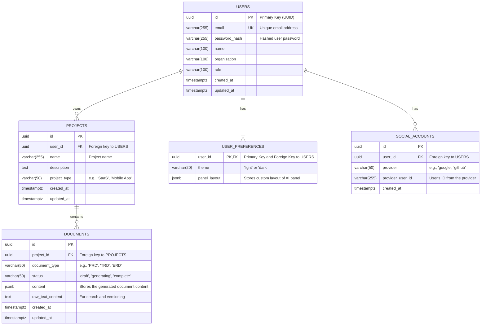
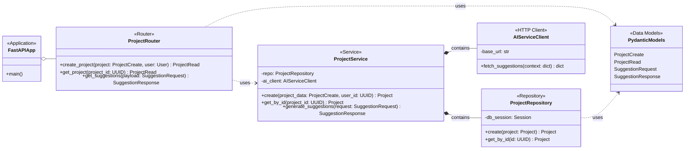

# Project

## Product Specification

### Introduction & Vision
This document outlines the requirements for an AI\-powered application designed to automate the generation of essential software development documentation\. The vision is to create a tool, inspired by services like `app.nautex.ai`, that empowers individual developers and small teams to produce high\-quality Product Requirements Documents \(PRDs\), Technical Requirements Documents \(TRDs\), and various system diagrams \(ERD, Blueprint, Class, Ingestion Flow\)\.The core problem being solved is the time\-consuming and often complex process of creating comprehensive project documentation from scratch\. This tool aims to streamline this workflow by leveraging AI to provide intelligent, context\-aware suggestions through a guided, user\-friendly interface\. The high\-level objective is to make robust project planning and documentation accessible, fast, and intuitive, particularly for users with limited resources\.### Target Audience & User Personas
The primary user of this application is an individual developer, startup founder, or a member of a small, resource\-constrained team\.#### User Persona: The Solo Developer / Founder
**Characteristics:** A technically\-skilled individual who may be working alone or leading a small team\. They are often responsible for multiple roles, including product, design, and engineering\. They may lack formal training in creating detailed documentation like PRDs or complex architectural diagrams\.

**Goals:** To rapidly translate an idea into a well\-defined project with clear documentation\. They need to structure their thoughts, create a plan for development, and potentially produce artifacts to share with future collaborators, investors, or early clients\.

**Motivations:** To accelerate the development lifecycle by automating the foundational documentation phase\. They seek to build with best practices without the overhead of manual document creation\.

### User Stories / Use Cases
As a user, I want to be guided through a step\-by\-step wizard when starting a new project so that I can provide all necessary information in a structured way\.

As a user, I want to create an account and profile so that I can save my projects and personalize my experience\.

As a user, I want to input a project name, description, and category so that the AI can generate relevant and context\-specific suggestions\.

As a user, I want to receive real\-time AI\-generated suggestions for document outlines, technical architectures, and database schemas so that I can accelerate my planning process\.

As a user, I want to interact directly with the AI suggestions, with the ability to accept, edit, or request refinements, so that I maintain full control over the final content\.

As a user, I want to see previews of what the final generated documents \(PRD, TRD, ERD\) will look like so I understand the value of each artifact\.

As a user, I want to select which specific documents and diagrams I need to generate for my project so that I don't create unnecessary artifacts\.

As a user, I want to use the application on both my desktop and mobile device so that I can work on my project from anywhere\.

As a user, I want to review a summary of all my inputs before finalizing the project setup so that I can catch any mistakes and make corrections\.

As a user, I want to personalize the application's appearance, such as choosing a light or dark theme, to ensure a comfortable user experience\.

### Functional Requirements
#### Onboarding and Project Setup
##### Welcome and Introduction
The application must present a welcome screen to new users\.

The welcome screen must provide a brief explanation of the application's purpose and benefits\.

The welcome screen must feature a prominent "Get Started" button to initiate the onboarding wizard\.

The screen must provide an option to view an introductory video or a quick tutorial\.

##### User Account Management
The system must provide user registration and login functionality\.

Users must be able to register using an email and password combination\.

Users must be able to log in using existing social media accounts\.

TODO: Clarify which social login providers should be supported for the initial launch\. Options: 1\. Google and GitHub only \(targets developers\)\. 2\. Google, GitHub, and Microsoft \(broader technical audience\)\. 3\. Google, Facebook, and LinkedIn \(broader professional audience\)\.

The system must allow users to create a basic profile with their name, organization, and role\.

The system must allow users to skip the detailed profile setup and proceed directly to project creation\.

##### Initial Project Creation
Users must be able to create a new project by providing a project name\.

Users must be able to add a short description or overview for the project\.

Users must select a project type or category \(e\.g\., SaaS, Internal Tool, Mobile App\) to help tailor AI suggestions\.

Users must be able to select from pre\-configured project templates\.

TODO: Define the initial set of pre\-configured project templates to be offered\. Options: 1\. Focus on web applications \(e\.g\., "E\-commerce Platform," "B2B SaaS," "Content Blog"\)\. 2\. Offer a broader range including mobile \(e\.g\., "Social Media App," "Utility App"\)\. 3\. Provide generic templates based on architecture \(e\.g\., "Microservices API," "Monolithic Web App"\)\.

#### AI\-Powered Suggestion Engine
##### Core Functionality
The system must feature an AI suggestions panel that is visible during the project setup process\.

The AI must generate initial suggestions based on the user\-provided project name, description, and type\.

The AI suggestions must update in real\-time as the user adds or modifies project details in the input fields\.

The system must provide an "Ask AI" or "AI Boost" option at any step to request enhanced suggestions or clarifications\.

##### Suggestion Content
The AI must be capable of generating a tailored PRD outline, including sections for objectives, user stories, and system requirements\.

The AI must be capable of generating initial TRD recommendations, including potential architecture considerations\.

The AI must be capable of generating a draft ERD, suggesting plausible entities and their relationships\.

The AI must be capable of generating suggestions for user journey flows and ingestion diagrams\.

The system must present links or visual previews for each artifact type \(PRD, TRD, ERD, etc\.\) so the user understands what will be generated\.

##### Interactivity
Users must be able to accept the AI\-generated outline or diagram as\-is\.

Users must be able to click on specific items within a suggestion to expand and edit the details directly inline\.

The system must provide a "refine suggestions" button that allows users to adjust the AI's focus \(e\.g\., emphasize UI/UX over backend architecture\)\.

The UI must include tooltips or inline hints that explain why a particular AI suggestion was made\.

#### User Interface and Experience
##### Layout and Design
The application must have a clean, modern, and minimalistic design with ample white space\.

A progress bar or indicator must be displayed at the top of the screen to show the user's current step in the onboarding wizard\.

The AI suggestions must be displayed in an interactive side or inline panel\.

AI\-generated content must be organized using card\-based or collapsible sections to prevent information overload\.

The UI must be responsive and adapt gracefully to both desktop and mobile screen sizes\.

##### User Interaction and Feedback
The system must use a clear visual hierarchy with distinct headings, icons, and color contrasts\.

The system must provide immediate visual feedback \(e\.g\., subtle animations, status messages\) when AI suggestions are updated\.

All interactive elements, such as buttons, must have clear state changes on hover and click\.

Mandatory and optional input fields must be clearly differentiated\.

The system must provide inline validation for user inputs to prevent errors\.

##### Personalization
Users must be able to choose from predefined UI themes, including a light and dark mode\.

Users must be able to customize the layout of the AI suggestions panel \(e\.g\., pin, resize, view as a modal\)\.

#### Finalization and Launch
Before completing the setup, the system must display a summary screen that reviews all information gathered during the wizard\.

From the summary screen, users must have the option to navigate back and edit the information from any previous step\.

A "Launch Project" button must be present on the summary screen to finalize the setup\.

Clicking "Launch Project" must transition the user into the main tool area where detailed documents and diagrams are managed\.

TODO: Define the core purpose of the "Main Work Area\." Options: 1\. A simple viewer where users can see and export the generated documents\. 2\. A full\-featured editor where users can continue to refine the documents and diagrams post\-generation\. 3\. A project dashboard that links to the generated documents and tracks their status\.

### Non\-Functional Requirements
#### Usability
The onboarding wizard must be intuitive enough for a first\-time, non\-technical user to complete without assistance\.

All AI\-generated suggestions should be presented in clear, simple language with explanations available via tooltips\.

The user interface must be consistent across all views and responsive on standard desktop and mobile browsers\.

#### Performance
User interface interactions, such as button clicks and screen transitions, should feel instantaneous\.

AI suggestions should update in near real\-time in response to user input\.

TODO: Clarify the acceptable latency for AI suggestion updates\. Options: 1\. Under 1\.5 seconds to feel highly responsive\. 2\. Between 1\.5 and 3 seconds, which is acceptable but noticeable\. 3\. Asynchronous loading where a spinner is shown for >3 seconds, prioritizing suggestion quality over speed\.

#### Security
The system must securely store user account credentials and personal information\.

All user project data must be treated as confidential and protected from unauthorized access\.

### Scope
#### In Scope
A complete, step\-by\-step user onboarding wizard for new project creation\.

User account creation, login, and basic profile management\.

An AI engine that generates and interactively displays suggestions for PRDs, TRDs, ERDs, blueprints, class diagrams, and ingestion flows based on user input\.

A responsive user interface with personalization options \(light/dark mode\)\.

A final review and confirmation screen before launching a project\.

#### Out of Scope
Real\-time, multi\-user collaboration features\.

Advanced project management capabilities beyond the initial setup wizard\.

The full\-featured editor or workspace for managing documents *after* the initial project launch\. The focus of this PRD is solely on the onboarding and AI\-suggestion generation phase\.

### Success Metrics
**Wizard Completion Rate:** Percentage of users who start the onboarding wizard and successfully click the "Launch Project" button\.

**AI Interaction Rate:** Percentage of users who actively edit, refine, or accept AI suggestions versus ignoring them\.

**Time\-to\-Launch:** The average time it takes for a user to complete the project setup wizard\.

**User Satisfaction \(CSAT/NPS\):** User\-reported satisfaction scores specifically concerning the quality, relevance, and usefulness of the AI\-generated suggestions\.

### Assumptions & Dependencies
**Assumption:** Users will have a sufficient high\-level idea of their project to provide a meaningful name, description, and type\.

**Assumption:** The primary value proposition of the application is the quality and interactivity of the AI suggestions during the setup phase\.

**Dependency:** The success of the application is critically dependent on the capabilities of the underlying AI model to generate accurate, relevant, and useful documentation artifacts from high\-level user inputs\.

## Technical Specification

### System Overview
This document provides the Technical Requirements Document \(TRD\) for an AI\-powered documentation generation platform, codenamed "DocuGen AI"\. The system is designed to fulfill the vision outlined in the Product Requirements Document \(PRD\), creating a tool inspired by `app.nautex.ai` that automates the creation of PRDs, TRDs, Entity Relationship Diagrams \(ERDs\), and other critical software development artifacts\.The core of the system is a guided, step\-by\-step web wizard that captures high\-level project ideas from users\. It then leverages a powerful AI engine to provide real\-time, interactive, and context\-aware suggestions for document structures, architectural patterns, and data models\. The user retains full control, with the ability to accept, edit, and refine these suggestions before generating the final documents\. The technical solution is architected to be modular, scalable, and highly responsive, prioritizing an intuitive and seamless user experience\.### Architectural Drivers
#### Goals
**Responsiveness:** The system must provide near real\-time feedback\. AI\-generated suggestions must update on the user's screen almost instantaneously in response to their input to create a fluid, interactive experience\.

**AI Quality & Relevance:** The core value proposition is the quality of AI suggestions\. The architecture must support sophisticated prompt engineering, context management, and interaction with state\-of\-the\-art Large Language Models \(LLMs\)\.

**Scalability:** The AI Suggestion Service is expected to be computationally intensive\. The architecture must allow this component to be scaled independently from the main web application to handle varying loads without degrading overall system performance\.

**Maintainability & Modularity:** A clean separation of concerns between the user interface, backend business logic, and the AI generation engine is paramount to facilitate parallel development, testing, and future enhancements\.

**User Experience \(UX\):** The entire technical stack must support a modern, clean, and highly interactive user interface as detailed in the PRD and user interview\.

#### Constraints
**Technology Stack:** The backend services will be built using Python to leverage its extensive ecosystem for AI/ML\. The frontend will be a modern JavaScript framework to deliver a rich user experience\.

**Deployment Environment:** The system will be designed for cloud\-native deployment, utilizing containerization to ensure consistency across development, testing, and production environments\.

**Security:** The system must handle user authentication and project data securely, ensuring data privacy and protection against unauthorized access\. All data in transit must be encrypted using TLS\.

### High\-Level Architecture
The system will be implemented using a Service\-Oriented Architecture \(SOA\) to ensure a clear separation of concerns and independent scalability of its core components\. This pattern is well\-suited to handle the stateless nature of the API and the potentially resource\-intensive, long\-running tasks of AI generation\.The main components are:**Frontend \(Single Page Application\):** The user\-facing application built with React and TypeScript\. It is responsible for rendering the entire UI, managing client\-side state, and communicating with the Backend API Service\.

**Backend API Service:** A stateless RESTful API built with FastAPI \(Python\) and Pydantic\. It serves as the central hub, handling user authentication, project data management \(CRUD\), and acting as a gateway that orchestrates requests to the AI Suggestion Service\.

**AI Suggestion Service:** A dedicated Python service responsible for all interactions with the external Large Language Model \(LLM\)\. It will manage complex prompt engineering, parse LLM responses, and format them into structured suggestions\. It exposes its functionality via an internal API \(REST or gRPC\)\.

**Database:** A PostgreSQL database will be used as the primary data store for all persistent data, including user accounts, projects, and generated document artifacts\.

**Async Task Queue:** A Celery and RabbitMQ queue will be used to offload long\-running or computationally expensive AI generation tasks\. This prevents blocking the API service and ensures the UI remains responsive\. For instance, generating a full document can be an async task, while real\-time suggestions will be synchronous\.

#### Components Diagram
```mermaid
flowchart TD
    subgraph "User's Browser"
        User([User]) --> Frontend[Frontend (React, TypeScript)];
    end

    subgraph "Cloud Infrastructure (e.g., AWS/GCP)"
        Frontend -- "HTTPS/JSON API Calls" --> BackendAPI[Backend API Service (FastAPI)];
        
        subgraph "AI Generation Subsystem"
            style AISubsystem fill:#f0f6ff, stroke:#58a6ff
            BackendAPI -- "Sync Requests (for real-time suggestions)" --> AIService[AI Suggestion Service (Python)];
            BackendAPI -- "Async Tasks (for full document generation)" --> TaskQueue[Task Queue (RabbitMQ)];
            TaskQueue --> AIWorker[AI Worker (Celery)];
            AIWorker -- "Executes Generation Logic" --> AIService;
        end

        BackendAPI -- "Reads/Writes Data (SQL)" --> Database[(PostgreSQL Database)];
        
        subgraph "External Services"
            AIService -- "API Calls" --> LLM[Large Language Model API (e.g., OpenAI, Anthropic)];
        end
    end

```

### Data Architecture and Models
A relational data model using PostgreSQL is chosen for its data integrity, transactional support, and powerful querying capabilities\. The use of JSONB columns will provide flexibility for storing semi\-structured data like AI\-generated content or user preferences\.#### Entity Relationship Diagram \(ERD\)


#### Core Data Models \(Pydantic\)
These models define the data contracts for the Backend API service, ensuring type safety and validation\. Frontend TypeScript interfaces will mirror these structures\.```python
#
# Pydantic Models for API Data Contracts
# Location: backend/app/models/
#

from pydantic import BaseModel, EmailStr, Field
from typing import Optional, List
from datetime import datetime
from uuid import UUID

# --- Base Models (DRY Principle) ---
class UUIDModel(BaseModel):
    id: UUID

class TimestampModel(BaseModel):
    created_at: datetime
    updated_at: datetime

# --- User Models ---
class UserBase(BaseModel):
    email: EmailStr
    name: Optional[str] = None
    organization: Optional[str] = None
    role: Optional[str] = None

class UserCreate(UserBase):
    password: str

class UserRead(UserBase, UUIDModel, TimestampModel):
    class Config:
        orm_mode = True

# --- Project Models ---
class ProjectBase(BaseModel):
    name: str = Field(..., min_length=3, max_length=255)
    description: Optional[str] = None
    project_type: str

class ProjectCreate(ProjectBase):
    pass

class ProjectRead(ProjectBase, UUIDModel, TimestampModel):
    user_id: UUID
    class Config:
        orm_mode = True

# --- AI Suggestion Models ---
class SuggestionRequest(BaseModel):
    project_id: UUID
    current_inputs: dict # e.g., {'name': '...', 'description': '...'}
    focus_area: Optional[str] = None # e.g., 'UI/UX', 'Backend'

class Suggestion(BaseModel):
    artifact_type: str # 'PRD', 'TRD', 'ERD'
    title: str
    content: dict | str # Could be a markdown string or a structured JSON object
    explanation: str # Tooltip text explaining the suggestion

class SuggestionResponse(BaseModel):
    suggestions: List[Suggestion]


```

### Component Blueprint & Class Diagram
This blueprint details the internal structure of the Backend API Service\. It follows a standard layered architecture with clear responsibilities for routing, business logic, and data access\.#### Class Diagram


### User Interface / User Experience Key Requirements
The UI must be clean, intuitive, and highly interactive, directly supporting the guided wizard flow identified as a key requirement\.#### General Look & Feel
**Design Language:** Modern, minimalistic, with generous white space to reduce cognitive load and focus the user on the task at hand\.

**Branding:** A simple, professional logo and color palette\.

**Themes:** Must support both a 'light' and a 'dark' mode theme, selectable by the user\. The selected theme will be persisted in `USER_PREFERENCES`\.

#### Onboarding Wizard Flow
The onboarding process is a linear, multi\-step wizard\. A progress bar at the top will always indicate the user's current position in the flow\.```mermaid
flowchart TD
    A[Start] --> B(Welcome Screen);
    B -- "Click 'Get Started'" --> C{User Authenticated?};
    C -- "No" --> D[Login / Register Screen];
    D --> E;
    C -- "Yes" --> E(Step 1: Initial Project Setup);
    E -- "Input Name, Desc, Type" --> F(Step 2: AI Suggestions & Refinement);
    F -- "User refines/accepts suggestions" --> G(Step 3: Summary & Confirmation);
    G -- "Click 'Edit'" --> E;
    G -- "Click 'Launch Project'" --> H(Main Project Workspace/Dashboard);
    H --> I[End];

    style F fill:#e3f2fd, stroke:#1565c0

```

#### Key Screens / Views
##### Welcome Screen
**Content:** Brief explanation of the app's value proposition\.

**Actions:** A single, prominent "Get Started" call\-to\-action button\. Optional link to a tutorial video\.

##### Account Creation / Login
**Functionality:** Standard email/password registration and login forms\. Social login options\.

TODO: Clarify which social login providers should be supported for the initial launch\. Options: 1\. **Google and GitHub only \(Recommended\)**: This directly targets the developer persona and simplifies initial implementation\. 2\. Google, GitHub, and Microsoft: Broadens appeal to a wider technical audience\. 3\. Google, Facebook, and LinkedIn: Appeals to a general professional audience but may be less relevant\.

##### Wizard Step 1: Initial Project Setup
**Form Fields:**

`Project Name`: Text input, mandatory\.

`Project Description`: Text area, optional but encouraged for better AI suggestions\.

`Project Type`: Dropdown select, mandatory\.

TODO: Define the initial set of pre\-configured project categories/types to be offered in the dropdown\. Options: 1\. **Focus on web applications \(Recommended\)**: \(e\.g\., "B2B SaaS," "E\-commerce Platform," "Content Blog," "API Service"\)\. 2\. Offer a broader range: Includes mobile types \(e\.g\., "Social Media App," "Utility App"\)\. 3\. Generic architectural templates: \(e\.g\., "Microservices Backend," "Monolithic Web App"\)\.

##### Wizard Step 2: AI Suggestions & Refinement
**Layout:** A two\-column layout\. The left column contains the input fields from Step 1 \(which remain editable\)\. The right column features the "AI Suggestions Panel"\.

**AI Suggestions Panel:**

This panel is the core interactive element\. It must update in near\-real time as the user types in the project description\.

Suggestions will be organized into collapsible, card\-based sections \(e\.g\., "PRD Outline," "Suggested Technologies," "Database Schema \(ERD\)"\)\.

Each suggestion item will have a hover\-over tooltip explaining the reasoning behind it\.

Users can click an "edit" icon to modify a suggestion inline or a "accept" button to approve it\.

A "Refine Suggestions" button allows the user to provide more specific focus, like "focus more on UI/UX"\.

##### Wizard Step 3: Summary & Confirmation
**Content:** A read\-only summary of all project details and key accepted AI suggestions\.

**Actions:**

"Edit" buttons next to each section, allowing the user to jump back to a previous step to make changes\.

A primary "Launch Project" button\.

TODO: Define the core purpose and functionality of the "Main Work Area" that users land in after clicking "Launch Project"\. Options: 1\. A simple viewer where users can see and export the generated documents\. 2\. A full\-featured editor where users can continue to refine the documents\. 3\. **A project dashboard \(Recommended\)**: This dashboard would link to the generated document viewers and could track their status \(e\.g\., 'Draft', 'Completed'\), providing a clear next step for the user without the complexity of a full editor in V1\.

#### UI Data Models \(TypeScript\)
```typescript
// Location: frontend/src/interfaces/
// These interfaces will mirror the Pydantic models.

export interface IUser {
  id: string; // UUID
  email: string;
  name?: string;
  organization?: string;
  role?: string;
}

export interface IProject {
  id: string; // UUID
  name: string;
  description?: string;
  project_type: string;
  created_at: string; // ISO 8601 date string
  updated_at: string;
}

export interface ISuggestion {
  artifact_type: 'PRD' | 'TRD' | 'ERD';
  title: string;
  content: Record<string, any> | string;
  explanation: string;
}

export interface ISuggestionResponse {
  suggestions: ISuggestion[];
}

```

#### Styling Plan
**Framework:** Use a component library like Material\-UI \(MUI\) or Ant Design to accelerate development and ensure consistency\.

**Styling Engine:** Employ a CSS\-in\-JS solution such as Emotion \(which integrates well with MUI\) or Styled\-components\. This allows for creating scoped, reusable, and dynamically themeable components\.

**Key Style Classes \(Conceptual\):**

`.wizard-progress-bar`: Visual indicator for wizard steps\.

`.ai-suggestion-panel`: The container for the real\-time AI suggestions\.

`.suggestion-card`: Individual card for each suggestion category\.

`.tooltip-custom`: Styled tooltips for explanations\.

### Mathematical Specifications and Formulas
Performance is a critical non\-functional requirement, particularly the perceived responsiveness of the AI engine\.#### AI Suggestion Latency
The end\-to\-end latency for AI suggestion updates must be strictly controlled\. This is defined as the time from the user's last keystroke in an input field to the moment the AI suggestion panel is visibly updated on the screen\.**Requirement:** `$T_{e2e\_latency} \le 1500ms$` for the 95th percentile of all suggestion requests\.

**Formula:** `$T_{e2e\_latency} = T_{network\_req} + T_{api\_processing} + T_{ai\_generation} + T_{network\_res} + T_{ui\_render}$`

**Variables:**

`$T_{network\_req}$`: Client\-to\-server network latency\.

`$T_{api\_processing}$`: Time taken by the Backend API to process the request\.

`$T_{ai\_generation}$`: Time taken by the AI Suggestion Service, including the call to the external LLM\. This is the most variable component\.

`$T_{network\_res}$`: Server\-to\-client network latency\.

`$T_{ui\_render}$`: Time taken by the React frontend to process the response and re\-render the component\.

#### Implementation Considerations:
To achieve this, the call from the frontend will be debounced \(e\.g\., 300ms\) to avoid sending requests on every keystroke\.

The `$T_{ai\_generation}$` will be closely monitored\. If LLM provider latency is high, strategies like using streaming responses will be investigated to improve perceived performance\.

### DEVOPS Requirements
#### Deployment and Orchestration
**Containerization:** All services \(Frontend, Backend API, AI Service, AI Worker\) must be containerized using Docker\. Dockerfiles must be optimized for build speed and small image size\.

**Orchestration:** The system will be deployed on a Kubernetes cluster \(e\.g\., AWS EKS, GKE\)\. This provides robust orchestration, auto\-scaling, and service discovery\. The AI Service and Workers will have their own deployment with a Horizontal Pod Autoscaler \(HPA\) configured to scale based on CPU/memory usage to handle variable loads\.

**CI/CD:** A CI/CD pipeline will be established using GitHub Actions\.

On every pull request: Run linters, unit tests, and security scans\.

On merge to `main` branch: Build and push Docker images to a container registry \(e\.g\., AWS ECR\)\. Automatically deploy to a staging environment\.

Manual trigger: Promote builds from staging to the production environment\.

#### Configuration Management
Environment\-specific configurations \(database URLs, API keys, LLM provider endpoints\) must be managed outside the container images\.

Kubernetes ConfigMaps and Secrets will be used to inject configuration into the running pods\.

#### Monitoring and Logging
**Metrics:** All services must expose key performance metrics \(e\.g\., request latency, error rates, queue depth\) in a Prometheus format\. A Grafana instance will be used for dashboards and alerting\.

**Logging:** All services must log structured JSON to `stdout`\. A log aggregation tool like Loki or the ELK stack will be used to collect, search, and analyze logs\.

**Tracing:** Distributed tracing \(e\.g\., using OpenTelemetry and Jaeger\) will be implemented to trace requests across the Backend API and AI Suggestion Service, which is crucial for debugging latency issues as defined in the performance requirements\.

### Implementation, Validation and Verification Strategy
The implementation will follow a risk\-first approach, prioritizing the most complex and uncertain components to validate core assumptions early in the development cycle\.#### Phased Implementation Plan
**Phase 0: AI Integration PoC \(De\-risking\)**

**Goal:** Validate the core value proposition\. Can we generate high\-quality suggestions?

**Tasks:** Build a standalone script/Jupyter notebook that implements the `AISuggestionService` logic\. Experiment with different LLM providers, prompt engineering techniques, and response parsing for the key artifact types \(PRD, TRD, ERD\)\. Define a quality baseline\.

**Verification:** Internal review of generated outputs against a set of benchmark project descriptions\.

**Phase 1: Core Backend & API Contracts**

**Goal:** Build the foundational backend services and define all data contracts\.

**Tasks:** Implement the Backend API service with user authentication, project CRUD operations, and endpoints for AI suggestions\. Implement the `AIServiceClient`\. Set up the database schema\.

**Validation:** Thorough unit and integration tests for all API endpoints\. API contract testing using a tool like Schemathesis\.

**Phase 2: Real\-time UI\-Backend Integration**

**Goal:** De\-risk the most critical user\-facing interaction\.

**Tasks:** Build a minimal frontend prototype of the "AI Suggestions & Refinement" screen\. Implement the debounced API calls and the real\-time update logic for the AI Suggestions Panel\.

**Verification:** E2E tests using Cypress or Playwright to assert that UI updates occur correctly and within the performance budget \(`$T_{e2e\_latency}$`\)\.

**Phase 3: Full Onboarding Wizard UI**

**Goal:** Implement the complete, polished user onboarding flow\.

**Tasks:** Build all UI screens for the wizard, including welcome, login/registration, project setup, and summary screens, based on the validated components from Phase 2\.

**Validation:** E2E tests covering all user paths through the wizard\. User Acceptance Testing \(UAT\)\.

#### External Integration Risks
**LLM Provider Dependency:** The quality and latency of the entire system are critically dependent on the external LLM provider\.

**De\-risking Strategy:** The `AIServiceClient` will be designed as an adapter\. This will allow swapping the LLM provider with minimal code changes if performance or quality issues arise\. We will also monitor the provider's status page and have a fallback plan\.

**Social Login Providers:** OAuth2\.0 implementations can have subtle differences\.

**De\-risking Strategy:** Use a well\-maintained, battle\-tested library \(e\.g\., `Authlib` for Python, `NextAuth.js` for React/Next\.js\) to handle the complexities of the OAuth2\.0 flows\. Implement one provider \(e\.g\., Google\) completely before adding others\.

## Files Tree

### README\.md
### backend
#### app
##### main\.py
##### api
###### routers
####### project\.py
####### auth\.py
##### services
###### project\_service\.py
##### repositories
###### project\_repository\.py
##### models
###### schemas\.py
###### database\.py
##### clients
###### ai\_service\_client\.py
##### core
###### config\.py
##### workers
###### tasks\.py
#### Dockerfile
#### requirements\.txt
### frontend
#### src
##### components
###### onboarding
####### Wizard\.tsx
####### ProjectSetupStep\.tsx
####### AISuggestionStep\.tsx
####### SummaryStep\.tsx
##### interfaces
###### index\.ts
##### styles
###### theme\.ts
##### App\.tsx
##### index\.tsx
#### Dockerfile
#### package\.json
### ai\_service
#### app
##### main\.py
##### services
###### suggestion\_service\.py
##### llm\_clients
#### Dockerfile
#### requirements\.txt
### \.github
#### workflows
##### ci\-cd\.yml
### k8s
### docker\-compose\.yml
