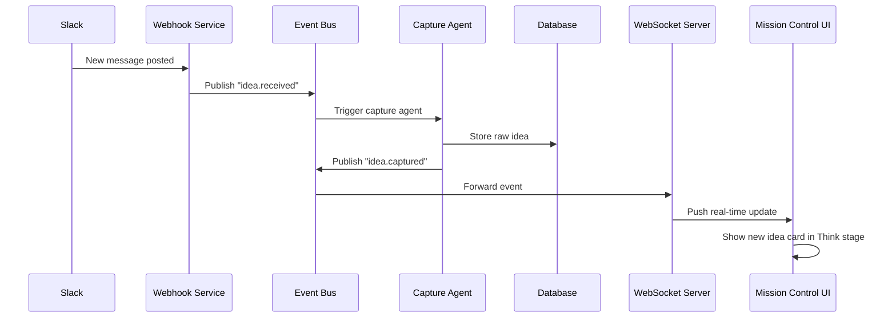
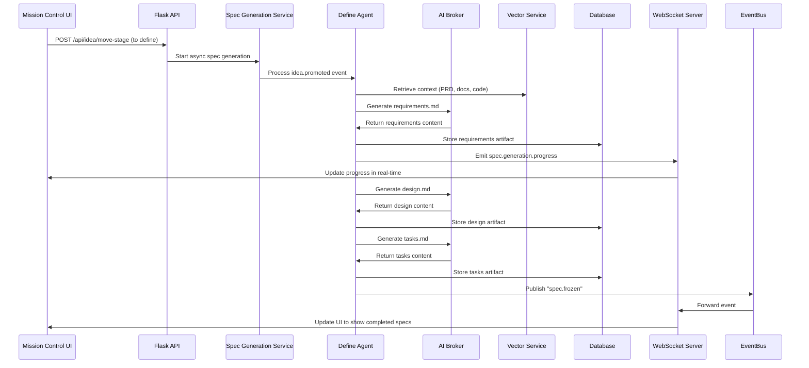
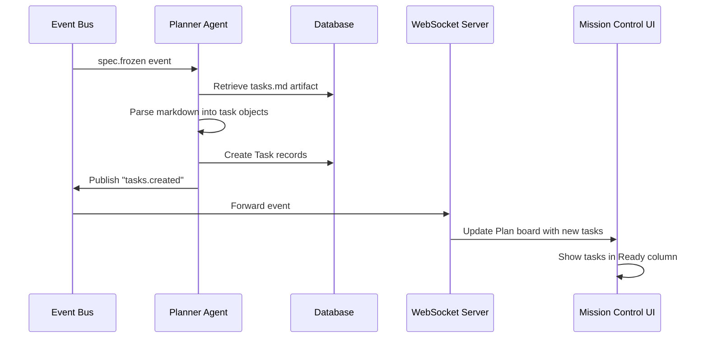
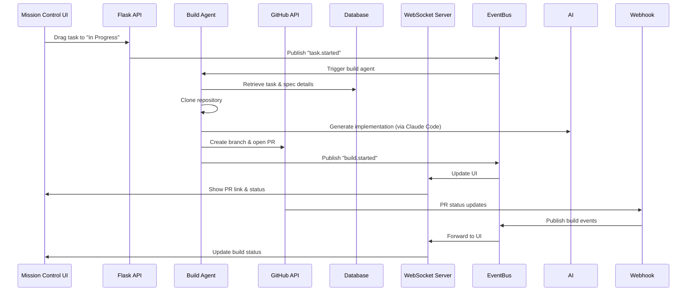
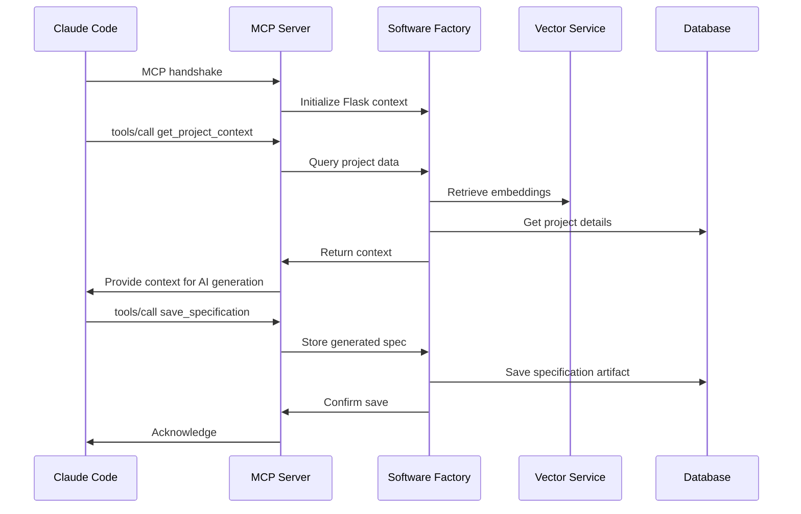

# Software Factory - Comprehensive Architecture & Business Logic Flow

## System Architecture Overview

```mermaid
graph TB
    %% External Systems
    subgraph "External Systems"
        Slack[Slack API]
        GitHub[GitHub API]
        MCP[MCP Server]
        Kiro[Kiro IDE]
        Cursor[Cursor IDE]
    end

    %% Frontend Layer
    subgraph "Frontend Layer"
        MC_UI[Mission Control UI]
        MC_DIST[Mission-Control-Dist]
        WebSocket_Client[WebSocket Client]
    end

    %% API Gateway Layer
    subgraph "API Gateway Layer"
        Flask_App[Flask Application]
        CORS[CORS Handler]
        WebSocket_Server[WebSocket Server]
        MCP_Server[MCP Server]
    end

    %% Service Layer
    subgraph "Service Layer"
        AI_Broker[AI Broker Service]
        Event_Bus[Event Bus]
        Spec_Generation[Spec Generation Service]
        Coding_Assistants[Coding Assistants]
        Auth_Service[Auth Service]
        Vector_Service[Vector Service]
    end

    %% Agent Layer
    subgraph "AI Agents"
        Define_Agent[Define Agent]
        Planner_Agent[Planner Agent]
        Code_Impact_Analyzer[Code Impact Analyzer]
        Project_Health_Monitor[Project Health Monitor]
        Kiro_Assistant[Kiro Assistant]
        Claude_Code_Assistant[Claude Code Assistant]
        Cursor_Assistant[Cursor Assistant]
    end

    %% Domain Logic Layer
    subgraph "Domain Logic"
        Domain_Packs[Domain Packs]
        Business_Logic[Business Logic]
        Validation_Rules[Validation Rules]
        SLA_Engine[SLA Engine]
    end

    %% Data Layer
    subgraph "Data Layer"
        Postgres[(PostgreSQL)]
        Redis[(Redis)]
        Vector_DB[(pgVector)]
        Event_Store[(Event Store)]
        File_Storage[File Storage]
    end

    %% External Connections
    Slack --> Webhook_Service
    GitHub --> GitHub_Service
    MCP --> MCP_Server
    Kiro --> Kiro_Assistant
    Cursor --> Cursor_Assistant

    %% Frontend Connections
    MC_UI --> Flask_App
    MC_DIST --> Flask_App
    WebSocket_Client --> WebSocket_Server

    %% API Layer Connections
    Flask_App --> AI_Broker
    Flask_App --> Event_Bus
    Flask_App --> Spec_Generation
    Flask_App --> Coding_Assistants
    Flask_App --> Auth_Service
    Flask_App --> Vector_Service
    Flask_App --> WebSocket_Server
    Flask_App --> MCP_Server

    %% Service to Agent Connections
    AI_Broker --> Define_Agent
    AI_Broker --> Planner_Agent
    AI_Broker --> Code_Impact_Analyzer
    AI_Broker --> Project_Health_Monitor
    AI_Broker --> Kiro_Assistant
    AI_Broker --> Claude_Code_Assistant
    AI_Broker --> Cursor_Assistant

    Event_Bus --> Define_Agent
    Event_Bus --> Planner_Agent
    Event_Bus --> Code_Impact_Analyzer
    Event_Bus --> Project_Health_Monitor

    Spec_Generation --> Define_Agent

    %% Agent to Domain Logic
    Define_Agent --> Domain_Packs
    Planner_Agent --> Domain_Packs
    Code_Impact_Analyzer --> Domain_Packs
    Project_Health_Monitor --> Domain_Packs

    %% Domain Logic to Data
    Domain_Packs --> Postgres
    Business_Logic --> Postgres
    Validation_Rules --> Postgres
    SLA_Engine --> Postgres

    Event_Bus --> Redis
    AI_Broker --> Redis
    WebSocket_Server --> Redis

    Vector_Service --> Vector_DB
    AI_Broker --> Vector_DB

    Event_Store --> Event_Store
    File_Storage --> File_Storage
```



## Detailed Business Logic Flow

### 1. Idea Capture & Processing Flow



### 2. Define Phase - Specification Generation Flow



### 3. Plan Phase - Task Planning Flow



### 4. Build Phase - Code Implementation Flow



### 5. MCP Integration Flow



## AI Agent Architecture

### Define Agent Prompts

#### Requirements Generation Prompt
```markdown
You are a senior product manager and business analyst with full filesystem access to analyze this repository.

FEATURE REQUEST:
[idea_content]

INSTRUCTIONS:
1. **ANALYZE THE REPOSITORY FIRST**: Use your filesystem access to examine:
   - Project structure and organization
   - Existing similar features and their implementation patterns
   - Technology stack (package.json, requirements.txt, etc.)
   - Database schemas and models
   - API patterns and routing structures
   - Component architectures and relationships
   - Testing patterns and infrastructure
   - Documentation and README files

2. **UNDERSTAND THE CONTEXT**: Understand:
   - The business domain and user workflows
   - Architectural patterns and conventions
   - Integration points and dependencies
   - Coding standards and best practices

3. **GENERATE REQUIREMENTS**: Create a comprehensive requirements.md that:
   - References actual files, classes, and patterns from the codebase
   - Follows established architectural patterns
   - Integrates with existing APIs and data models
   - Uses the same technology stack and conventions
   - Mentions specific files that need modification or creation
   - Provides implementation guidance based on existing patterns

4. **REQUIREMENTS STRUCTURE**: Generate a comprehensive requirements.md with:

# Requirements Document

## Overview
- Feature description and business value
- Success metrics and acceptance criteria
- Dependencies and prerequisites

## Functional Requirements
### User Stories
- **As a [user]**, **I want [goal]**, **so that [benefit]**
- **As a [user]**, **I want [goal]**, **so that [benefit]**

## Non-Functional Requirements
### Performance
- Response time requirements
- Throughput requirements
- Resource utilization limits

### Security
- Authentication and authorization requirements
- Data privacy and compliance requirements
- Security controls and measures

### Usability
- User interface requirements
- Accessibility requirements
- Mobile responsiveness requirements

### Compatibility
- Browser support requirements
- Device compatibility requirements
- Integration requirements

## Technical Requirements
### API Requirements
- Endpoint specifications
- Request/response formats
- Authentication mechanisms

### Database Requirements
- Schema changes required
- Data migration requirements
- Performance considerations

### Integration Requirements
- Third-party service integrations
- Internal service dependencies
- Data flow requirements

## Implementation Notes
- Reference to existing similar implementations
- Specific files that need modification
- New components that need creation
- Testing requirements and strategies
```

#### Design Generation Prompt
```markdown
You are a senior software architect with full filesystem access to analyze this repository.

[AI Context with PRD and Requirements]

INSTRUCTIONS:
1. **ANALYZE THE REPOSITORY**: Use your filesystem access to examine
   - Current architecture and design patterns
   - Database schemas and data models
   - API structures and service patterns
   - UI/UX components and design systems
   - Integration patterns and middleware

2. **CREATE REPOSITORY-AWARE DESIGN**: Generate design.md that:
   - Extends existing architectural patterns
   - Integrates with current data models and APIs
   - Follows established design conventions
   - References specific files and components
   - Uses the same technology stack

Create a design.md document with this structure:

# Design Document

## Overview
- Feature overview and architectural approach
- Integration with existing system components
- Key design decisions and rationale

## Architecture
- High-level architecture diagram (ASCII art)
- Component relationships and data flow
- Technology stack and dependencies

## Data Model
- Database schema changes
- Entity relationships
- Data migration strategy

## API Design
- New endpoints and modifications
- Request/response schemas
- Authentication and authorization

## UI/UX Design
- Component structure and layout
- User interaction flows
- Responsive design considerations

## Implementation Plan
- Development phases and milestones
- Risk assessment and mitigation
- Testing strategy and approach

## Security Considerations
- Security requirements and controls
- Data protection measures
- Compliance requirements

## Performance Considerations
- Performance requirements and targets
- Scalability considerations
- Monitoring and alerting

## Deployment Strategy
- Deployment plan and rollback procedure
- Configuration management
- Environment-specific considerations
```

#### Tasks Generation Prompt
```markdown
You are a senior technical lead with full filesystem access to analyze this repository.

[AI Context with PRD, Requirements, and Design]

INSTRUCTIONS:
1. **ANALYZE THE REPOSITORY**: Use your filesystem access to examine current code organization, testing frameworks, and build processes.
2. **CREATE IMPLEMENTATION PLAN**: Generate tasks.md where each checklist item is a discrete coding task that references requirements and builds incrementally.

Generate a comprehensive tasks.md document.

# Implementation Tasks

## Phase 1: Foundation
- [ ] **TASK-001**: Set up development environment and dependencies
  - Description: Install required packages and configure development environment
  - Requirements: REQ-001, REQ-002
  - Files: requirements.txt, package.json
  - Effort: 2 hours
  - Owner: Developer

- [ ] **TASK-002**: Create database schema changes
  - Description: Implement required database migrations
  - Requirements: REQ-010, REQ-011
  - Files: migrations/, models/
  - Effort: 4 hours
  - Owner: Backend Developer

## Phase 2: Core Implementation
- [ ] **TASK-003**: Implement API endpoints
  - Description: Create REST API endpoints following existing patterns
  - Requirements: REQ-020, REQ-021, REQ-022
  - Files: api/, routes/
  - Effort: 8 hours
  - Owner: Backend Developer
  - Depends on: TASK-002

## Phase 3: Integration
- [ ] **TASK-004**: Update frontend components
  - Description: Modify UI components to support new functionality
  - Requirements: REQ-030, REQ-031
  - Files: frontend/, components/
  - Effort: 6 hours
  - Owner: Frontend Developer
  - Depends on: TASK-003

## Phase 4: Testing
- [ ] **TASK-005**: Write unit tests
  - Description: Create comprehensive unit test coverage
  - Requirements: REQ-040
  - Files: tests/, test files
  - Effort: 4 hours
  - Owner: QA Developer
  - Depends on: TASK-003, TASK-004

## Phase 5: Documentation
- [ ] **TASK-006**: Update API documentation
  - Description: Update OpenAPI/Swagger documentation
  - Requirements: REQ-050
  - Files: docs/, README.md
  - Effort: 2 hours
  - Owner: Technical Writer
  - Depends on: TASK-003
```

### Kiro-Style Prompts

#### Kiro Requirements Generation
```markdown
You are an AI assistant like Kiro, with full filesystem access to analyze the repository and understand the codebase.

=== KIRO-STYLE CONTEXT ANALYSIS ===
You have full repository access like Kiro. Use it to understand:
- Current codebase architecture and patterns
- Existing similar features and implementations
- Technology stack and dependencies
- Database schemas and API patterns
- UI components and design patterns

FEATURE REQUEST:
[idea_content]

INSTRUCTIONS:
1. **ANALYZE THE REPOSITORY FIRST**: Use your filesystem access to examine:
   - Project structure and organization
   - Existing similar features and their implementation patterns
   - Technology stack (package.json, requirements.txt, etc.)
   - Database schemas and models
   - API patterns and routing structures
   - Component architectures and relationships
   - Testing patterns and infrastructure
   - Documentation and README files

2. **UNDERSTAND THE CONTEXT**: Like Kiro reads steering documents, understand:
   - The business domain and user workflows
   - Architectural patterns and conventions
   - Integration points and dependencies
   - Coding standards and best practices

3. **GENERATE CONTEXTUAL SPECIFICATION**: Create a requirements.md that:
   - References actual files, classes, and patterns from the codebase
   - Follows established architectural patterns
   - Integrates with existing APIs and data models
   - Uses the same technology stack and conventions
   - Mentions specific files that need modification or creation
   - Provides implementation guidance based on existing patterns
```

### MCP Server Prompts

#### Get Project Context Tool
```python
@mcp.tool()
async def get_project_context(project_id: str) -> dict:
    """
    Get comprehensive project context for specification generation.

    This tool provides:
    - Project metadata and configuration
    - Repository structure and key files
    - Existing specifications and documentation
    - System architecture and patterns
    - Domain knowledge and business rules

    Args:
        project_id: The project identifier

    Returns:
        Comprehensive project context for AI generation
    """
```

#### Save Specification Tool
```python
@mcp.tool()
async def save_specification(project_id: str, spec_type: str, content: str, metadata: dict = None) -> dict:
    """
    Save a generated specification to the Software Factory.

    This tool stores AI-generated specifications in the database
    and associates them with the appropriate project and workflow stage.

    Args:
        project_id: The project identifier
        spec_type: Type of specification ('requirements', 'design', 'tasks')
        content: The specification content in markdown format
        metadata: Additional metadata about the generation process

    Returns:
        Confirmation of successful save with specification ID
    """
```

### Coding Assistant Prompts

#### Claude Code Assistant - Code Generation
```markdown
Generate code based on the following requirements:

[prompt]

Please provide clean, well-documented code that follows best practices.

Context:
- Business Context: [business_context]
- Repository: [github_repo details]
- Role: [role]

Relevant files:
[file_list]
```

#### Claude Code Assistant - Code Review
```markdown
Review the following code and provide feedback:

[prompt]

Please identify potential issues, suggest improvements, and highlight best practices.

Context:
- Business Context: [business_context]
- Repository: [github_repo details]
- Role: [role]

Relevant files:
[file_list]
```

#### Kiro Assistant - Architecture Analysis
```markdown
Analyze the architecture of the following system:

[prompt]

Please provide insights on the design patterns, potential improvements, and architectural recommendations.

Capability: architecture_analysis
Context: [context]
Files: [files]
```

### PRD Generation Prompts

#### PRD Generation Context Validation
```markdown
You are generating a Product Requirements Document (PRD) for a software feature request.

CONTEXT VALIDATION:
- PRD Status: [has_prd]
- PRD Type: [prd_type]
- Context Level: [context_level]
- Total PRDs: [total_prds]
- Frozen PRDs: [frozen_prds]

IDEA CONTENT:
[idea_content]

INSTRUCTIONS:
1. **VALIDATE CONTEXT**: Assess whether existing PRDs provide sufficient context
2. **IDENTIFY GAPS**: Determine what additional context is needed
3. **RECOMMEND APPROACH**: Suggest whether to use existing PRD or create new one
4. **GENERATE PRD**: If needed, create a comprehensive PRD

GENERATE PRD WITH THIS STRUCTURE:

# Product Requirements Document (PRD)

## Executive Summary
- Feature name and overview
- Business objective and success metrics
- Timeline and milestones

## Problem Statement
- Current situation and pain points
- Target user and use cases
- Impact assessment

## Solution Overview
- Proposed solution and approach
- Key features and capabilities
- User experience improvements

## Requirements
### Functional Requirements
- Detailed feature specifications
- User stories and acceptance criteria
- Business rules and workflows

### Non-Functional Requirements
- Performance requirements
- Security and compliance
- Scalability and reliability

## Technical Considerations
- Technology stack and dependencies
- Integration requirements
- Data architecture

## Success Metrics
- Key performance indicators
- User adoption targets
- Business impact measures

## Risks and Mitigation
- Technical risks
- Business risks
- Mitigation strategies

## Implementation Plan
- High-level development phases
- Dependencies and prerequisites
- Rollout strategy
```

## Domain Pack Business Logic

### Default Domain Pack
```yaml
pack:
  name: "Default Domain Pack"
  version: "1.0.0"
  owner_team: "platform"
  description: "Default fallback domain pack with universal failure modes for any application domain"

defaults:
  sla:
    Event.Default: 600000           # 10 minutes
    Notification: 300000            # 5 minutes
    Update: 180000                  # 3 minutes
    Alert: 120000                   # 2 minutes
    Reminder: 900000                # 15 minutes

  review:
    insight_thresholds:
      cluster_min: 5
      window_minutes: 60
    auto_tag_confidence: 0.85

  sla_overrides:
    by_channel:
      SMS:
        Notification: 240000
      Email:
        Notification: 420000
      Push:
        Alert: 60000
    by_priority:
      High:
        Alert: 60000
      Medium:
        Notification: 300000
      Low:
        Reminder: 1800000
```

### Validation Rules
```yaml
# Consent Compliance Validation
consent_compliance:
  name: "Consent Compliance"
  description: "Validate user consent requirements for data processing"
  rules:
    - name: "GDPR Consent Check"
      condition: "user_region == 'EU' and data_processing_type == 'marketing'"
      action: "require_explicit_consent"
      severity: "critical"

# Duplicate Suppression Validation
duplicate_suppression:
  name: "Duplicate Suppression"
  description: "Prevent duplicate communications within specified timeframes"
  rules:
    - name: "Time-based Suppression"
      condition: "communication_type == 'SMS' and time_window_minutes < 60"
      action: "suppress_duplicate"
      severity: "warning"

# Eligibility Compliance Validation
eligibility_compliance:
  name: "Eligibility Compliance"
  description: "Validate user eligibility for specific communications"
  rules:
    - name: "Age Verification"
      condition: "communication_type == 'marketing' and user_age < 18"
      action: "block_communication"
      severity: "critical"
```

## Event-Driven Architecture Patterns

### Event Types
```python
class EventType(Enum):
    # Idea Management Events
    IDEA_RECEIVED = "idea.received"
    IDEA_CAPTURED = "idea.captured"
    IDEA_PROMOTED = "idea.promoted"
    IDEA_REJECTED = "idea.rejected"

    # Specification Events
    SPEC_DRAFTED = "spec.drafted"
    SPEC_FROZEN = "spec.frozen"
    SPEC_APPROVED = "spec.approved"
    SPEC_REJECTED = "spec.rejected"

    # Task Management Events
    TASK_CREATED = "task.created"
    TASK_STARTED = "task.started"
    TASK_COMPLETED = "task.completed"
    TASK_BLOCKED = "task.blocked"

    # Build Events
    BUILD_STARTED = "build.started"
    BUILD_SUCCEEDED = "build.succeeded"
    BUILD_FAILED = "build.failed"
    BUILD_CANCELLED = "build.cancelled"

    # Validation Events
    VALIDATION_STARTED = "validation.started"
    VALIDATION_PASSED = "validation.passed"
    VALIDATION_FAILED = "validation.failed"

    # Learning Events
    INSIGHT_GENERATED = "insight.generated"
    PATTERN_DISCOVERED = "pattern.discovered"
    RECOMMENDATION_MADE = "recommendation.made"
```

### Event Flow Patterns
```python
# Synchronous Event Processing
def process_idea_promotion(idea_id: str, project_id: str):
    # 1. Validate idea exists
    # 2. Publish idea.promoted event
    # 3. Wait for DefineAgent to process
    # 4. Return spec generation status

# Asynchronous Event Processing
def handle_spec_frozen(event_data: dict):
    # 1. Extract spec_id and project_id
    # 2. Retrieve tasks.md artifact
    # 3. Parse tasks into Task objects
    # 4. Create Task records in database
    # 5. Publish tasks.created event
    # 6. Update UI via WebSocket

# Event Chain Processing
def handle_task_started(event_data: dict):
    # 1. Update task status to IN_PROGRESS
    # 2. Trigger BuildAgent
    # 3. Clone repository
    # 4. Generate implementation
    # 5. Create PR via GitHub API
    # 6. Publish build.started event
```

## Data Architecture

### Core Models
```python
class MissionControlProject(db.Model):
    """Project model for Mission Control"""
    id = db.Column(db.String(50), primary_key=True)
    name = db.Column(db.String(200), nullable=False)
    description = db.Column(db.Text)
    repo_url = db.Column(db.String(500))
    slack_channel = db.Column(db.String(100))
    created_at = db.Column(db.DateTime, default=datetime.utcnow)
    updated_at = db.Column(db.DateTime, default=datetime.utcnow, onupdate=datetime.utcnow)

class FeedItem(db.Model):
    """Idea/feed item model"""
    id = db.Column(db.String(50), primary_key=True)
    project_id = db.Column(db.String(50), db.ForeignKey('mission_control_project.id'))
    title = db.Column(db.String(500), nullable=False)
    summary = db.Column(db.Text)
    content = db.Column(db.Text)
    severity = db.Column(db.String(20), default='info')
    created_at = db.Column(db.DateTime, default=datetime.utcnow)
    source = db.Column(db.String(50), default='slack')

class SpecificationArtifact(db.Model):
    """Specification artifact model"""
    id = db.Column(db.String(50), primary_key=True)
    spec_id = db.Column(db.String(50), nullable=False)
    project_id = db.Column(db.String(50), nullable=False)
    artifact_type = db.Column(db.String(20), nullable=False)  # requirements, design, tasks
    content = db.Column(db.Text, nullable=False)
    status = db.Column(db.String(20), default='draft')  # draft, approved, rejected
    version = db.Column(db.Integer, default=1)
    created_at = db.Column(db.DateTime, default=datetime.utcnow)
    updated_at = db.Column(db.DateTime, default=datetime.utcnow, onupdate=datetime.utcnow)

class Task(db.Model):
    """Task model for implementation planning"""
    id = db.Column(db.String(50), primary_key=True)
    spec_id = db.Column(db.String(50), nullable=False)
    project_id = db.Column(db.String(50), nullable=False)
    task_number = db.Column(db.Integer, nullable=False)
    title = db.Column(db.String(500), nullable=False)
    description = db.Column(db.Text)
    status = db.Column(db.String(20), default='ready')  # ready, in_progress, completed, blocked
    priority = db.Column(db.String(20), default='medium')  # low, medium, high, urgent
    effort_estimate_hours = db.Column(db.Float, default=2.0)
    suggested_owner = db.Column(db.String(100), default='Developer')
    parent_task_id = db.Column(db.String(50))
    created_at = db.Column(db.DateTime, default=datetime.utcnow)
    updated_at = db.Column(db.DateTime, default=datetime.utcnow, onupdate=datetime.utcnow)
```

### Vector Embeddings Schema
```sql
-- Vector embeddings for semantic search
CREATE TABLE document_embeddings (
    id SERIAL PRIMARY KEY,
    project_id VARCHAR(50) NOT NULL,
    document_type VARCHAR(50) NOT NULL,  -- prd, spec, code, docs
    document_id VARCHAR(50) NOT NULL,
    content_type VARCHAR(50) NOT NULL,   -- chunk, file, function, class
    content_id VARCHAR(100) NOT NULL,
    content TEXT NOT NULL,
    embedding VECTOR(1536),  -- OpenAI Ada-002 embedding dimensions
    metadata JSONB,
    created_at TIMESTAMP DEFAULT CURRENT_TIMESTAMP
);

-- Indexes for efficient similarity search
CREATE INDEX idx_document_embeddings_project ON document_embeddings(project_id);
CREATE INDEX idx_document_embeddings_type ON document_embeddings(document_type);
CREATE INDEX idx_document_embeddings_embedding ON document_embeddings USING ivfflat (embedding vector_cosine_ops);
```

## Security Architecture

### Authentication & Authorization
```python
class AuthService:
    """Authentication and authorization service"""

    def validate_bearer_token(self, token: str) -> dict:
        """Validate JWT bearer token and return user context"""
        # Decode JWT token
        # Verify signature and expiration
        # Return user_id, project_ids, permissions
        pass

    def authorize_project_access(self, user_id: str, project_id: str) -> bool:
        """Check if user has access to project"""
        # Query user_project_permissions table
        # Check role-based permissions
        # Return boolean
        pass

    def authorize_stage_transition(self, user_id: str, project_id: str,
                                 from_stage: str, to_stage: str) -> bool:
        """Check if user can transition item between stages"""
        # Validate stage transition rules
        # Check business logic constraints
        # Return boolean
        pass
```

### WebSocket Security
```python
class WebSocketServer:
    """Secure WebSocket server with authentication"""

    def authenticate_connection(self, token: str) -> dict:
        """Authenticate WebSocket connection"""
        # Validate bearer token
        # Extract user context
        # Subscribe to project-specific events
        pass

    def authorize_event_access(self, user_context: dict, event: Event) -> bool:
        """Check if user can receive event"""
        # Verify project_id in user's allowed projects
        # Check event type permissions
        # Return boolean
        pass

    def filter_events_for_user(self, user_context: dict, events: list) -> list:
        """Filter events based on user permissions"""
        # Remove events user cannot access
        # Maintain real-time performance
        # Return filtered events
        pass
```

## Performance Architecture

### Caching Strategy
```python
class DistributedCache:
    """Multi-level caching strategy"""

    def __init__(self):
        self.l1_cache = {}  # In-memory cache
        self.redis_client = None
        self.cache_ttl = 300  # 5 minutes default

    def get(self, key: str, namespace: str = 'default'):
        """Multi-level cache retrieval"""
        # Check L1 cache first
        # Check Redis if not in L1
        # Return cached value or None
        pass

    def set(self, key: str, value: any, ttl: int = None, namespace: str = 'default'):
        """Multi-level cache storage"""
        # Store in Redis
        # Update L1 cache
        # Handle serialization
        pass

    def invalidate_pattern(self, pattern: str, namespace: str = 'default'):
        """Invalidate cache entries matching pattern"""
        # Remove from Redis
        # Clear L1 cache entries
        pass
```

### Background Job Processing
```python
class BackgroundJobManager:
    """Asynchronous job processing with resource management"""

    def __init__(self, max_workers: int = 4):
        self.executor = ThreadPoolExecutor(max_workers=max_workers)
        self.job_queue = PriorityQueue()
        self.active_jobs = {}

    def submit_job(self, job_type: str, **kwargs) -> str:
        """Submit background job"""
        # Generate job ID
        # Create job context
        # Submit to executor
        # Track job status
        pass

    def get_job_status(self, job_id: str) -> dict:
        """Get job execution status"""
        # Check active jobs
        # Query database for completed jobs
        # Return status information
        pass

    def cancel_job(self, job_id: str) -> bool:
        """Cancel running job"""
        # Find job in active jobs
        # Cancel future execution
        # Clean up resources
        pass
```

## Monitoring & Observability

### Metrics Collection
```python
class MetricsService:
    """Comprehensive metrics collection"""

    def __init__(self):
        self.prometheus_registry = None
        self.setup_metrics()

    def setup_metrics(self):
        """Setup Prometheus metrics"""
        # Request latency histogram
        # Error rate counter
        # Active connections gauge
        # Event processing duration histogram
        # AI agent performance metrics
        pass

    def record_event_processing_time(self, event_type: str, duration: float):
        """Record event processing time"""
        # Update Prometheus histogram
        # Add labels for event type
        pass

    def record_ai_agent_performance(self, agent_type: str, success: bool, duration: float):
        """Record AI agent performance"""
        # Update success/failure counters
        # Record processing time
        pass
```

### Logging Architecture
```python
class StructuredLogger:
    """Structured logging with context"""

    def __init__(self, component: str):
        self.component = component
        self.logger = logging.getLogger(component)

    def log_event(self, event_type: str, data: dict, level: str = 'info'):
        """Log structured event"""
        # Add component context
        # Add timestamp
        # Add correlation ID
        # Log to appropriate handler
        pass

    def log_error(self, error: Exception, context: dict = None):
        """Log error with context"""
        # Extract stack trace
        # Add error context
        # Log to error handler
        pass

    def log_performance(self, operation: str, duration: float, metadata: dict = None):
        """Log performance metrics"""
        # Add operation context
        # Add performance data
        # Log to metrics handler
        pass
```

### Work Order Generation Prompts

#### Comprehensive Work Order Prompt
```markdown
You are an expert business analyst and project manager. Generate comprehensive work order content for the following task, including detailed description, requirements, and context sections.

[Context with PRD, Requirements, Design, and Task Details]

FEATURE REQUEST:
[task_title]

TASK DESCRIPTION:
[task_description]

INSTRUCTIONS:
1. **ANALYZE CONTEXT**: Review the provided PRD, requirements, design documents, and task details
2. **GENERATE COMPREHENSIVE CONTENT**: Create detailed work order content including:
   - Clear purpose and business objective
   - Detailed requirements with acceptance criteria
   - Out of scope items
   - Context and background information
   - Blueprint and PRD references

3. **STRUCTURE OUTPUT**: Generate a comprehensive work order with this structure:

# Work Order: [Task Title]

## Purpose
- Business objective and value proposition
- Success criteria and metrics
- Alignment with overall project goals

## Requirements
- Detailed functional requirements
- Non-functional requirements (performance, security, usability)
- Integration requirements
- Dependencies and prerequisites

## Context & Background
- Business context and user workflows
- Technical context and architecture considerations
- Historical context and related decisions

## Out of Scope
- Items explicitly not included in this task
- Related work that may be done separately
- Future considerations or enhancements

## References
- PRD: [PRD reference]
- Design Document: [Design reference]
- Requirements: [Requirements reference]
- Blueprint: [Blueprint reference]
```

#### Implementation Plan Generation Prompt
```markdown
You are a senior technical lead tasked with creating a detailed implementation plan for a specific work order.

WORK ORDER DETAILS:
- Title: [work_order_title]
- Description: [work_order_description]
- Requirements: [work_order_requirements]
- Context: [work_order_context]

TECHNICAL CONTEXT:
- Repository Structure: [repository_analysis]
- Technology Stack: [tech_stack_analysis]
- Existing Patterns: [pattern_analysis]
- Dependencies: [dependency_analysis]

INSTRUCTIONS:
1. **ANALYZE REQUIREMENTS**: Break down the work order into discrete implementation steps
2. **CONSIDER ARCHITECTURE**: Ensure implementation follows existing patterns and architecture
3. **CREATE DETAILED PLAN**: Generate step-by-step implementation with:
   - Specific code changes required
   - Files that need modification/creation
   - Testing strategy for each step
   - Validation criteria for completion

4. **SEQUENCE LOGICALLY**: Order steps to build incrementally with working software at each stage

GENERATE IMPLEMENTATION PLAN WITH THIS STRUCTURE:

# Implementation Plan for [Work Order Title]

## Phase 1: Foundation
### Step 1.1: [Specific Task]
- **Objective**: [What this step achieves]
- **Changes Required**:
  - File: [specific_file] - [what changes]
  - File: [another_file] - [what changes]
- **Testing**: [How to validate this step]
- **Acceptance Criteria**: [How to know this step is complete]

### Step 1.2: [Next Task]
[... continues with detailed steps]

## Phase 2: Core Implementation
[... continues with implementation phases]

## Phase 3: Integration & Testing
[... continues with testing and integration]

## Success Criteria
- [ ] All acceptance criteria met
- [ ] Code follows existing patterns
- [ ] Comprehensive test coverage
- [ ] Documentation updated
- [ ] No breaking changes to existing functionality
```

## Complete AI Agent Prompt Collection

### Summary of All Extracted Prompts

1. **Define Agent - Requirements Generation**
   - Analyzes repository structure and existing patterns
   - Generates comprehensive requirements.md with functional/non-functional requirements
   - References specific files and architectural patterns from codebase

2. **Define Agent - Design Generation**
   - Creates repository-aware design documents
   - Includes ASCII architecture diagrams and TypeScript interfaces
   - Follows existing patterns and integrates with current data models

3. **Define Agent - Tasks Generation**
   - Creates implementation checklists with discrete coding tasks
   - References requirements and builds incrementally
   - Includes effort estimates and suggested owners

4. **Kiro-Style Prompts**
   - Repository-aware specification generation
   - Uses full filesystem access like Kiro IDE
   - Discovers steering documents and analyzes codebase patterns

5. **MCP Server Prompts**
   - Project context extraction for external AI tools
   - Specification saving and management
   - Integration with Claude Code and other MCP clients

6. **Coding Assistant Prompts**
   - Claude Code integration for code generation
   - Code review and refactoring capabilities
   - Architecture analysis and debugging support

7. **Work Order Generation Prompts**
   - Comprehensive work order creation from specifications
   - Implementation plan generation with detailed steps
   - Context-aware task breakdown and sequencing

### Key AI Agent Capabilities

#### Define Agent Capabilities
- **Repository Analysis**: Full filesystem access to understand codebase
- **Context Integration**: Incorporates PRD, existing code patterns, and business context
- **Iterative Generation**: Creates requirements → design → tasks in sequence
- **Quality Assurance**: Ensures specifications are implementable and follow standards

#### Kiro-Style Agent Capabilities
- **Steering Discovery**: Automatically finds documentation and context files
- **Pattern Recognition**: Analyzes existing code patterns and architectural decisions
- **Contextual Generation**: Creates specifications that integrate with existing systems
- **Repository Awareness**: References actual files and components in generated specs

#### MCP Integration Capabilities
- **External Tool Support**: Enables Claude Code and other tools to access project context
- **Specification Management**: Stores and retrieves generated specifications
- **Context Provision**: Provides comprehensive project context for AI generation
- **Workflow Integration**: Supports external development workflows

#### Coding Assistant Capabilities
- **Multi-Provider Support**: Integrates Claude Code, Cursor, Kiro, and other assistants
- **Capability Routing**: Routes tasks to most appropriate AI assistant
- **Context Preservation**: Maintains business context across interactions
- **Quality Assurance**: Validates generated code against existing patterns

This comprehensive architecture documentation provides a complete view of the Software Factory system, including its event-driven architecture, AI agent integrations, business logic flows, and technical implementation details.
