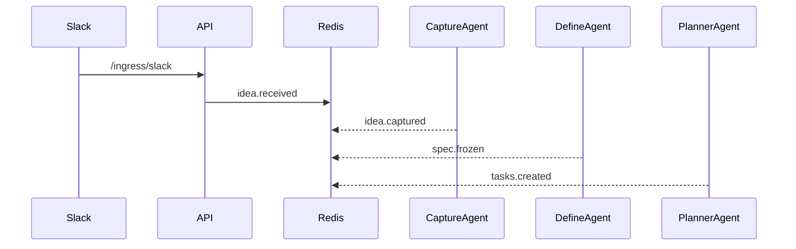
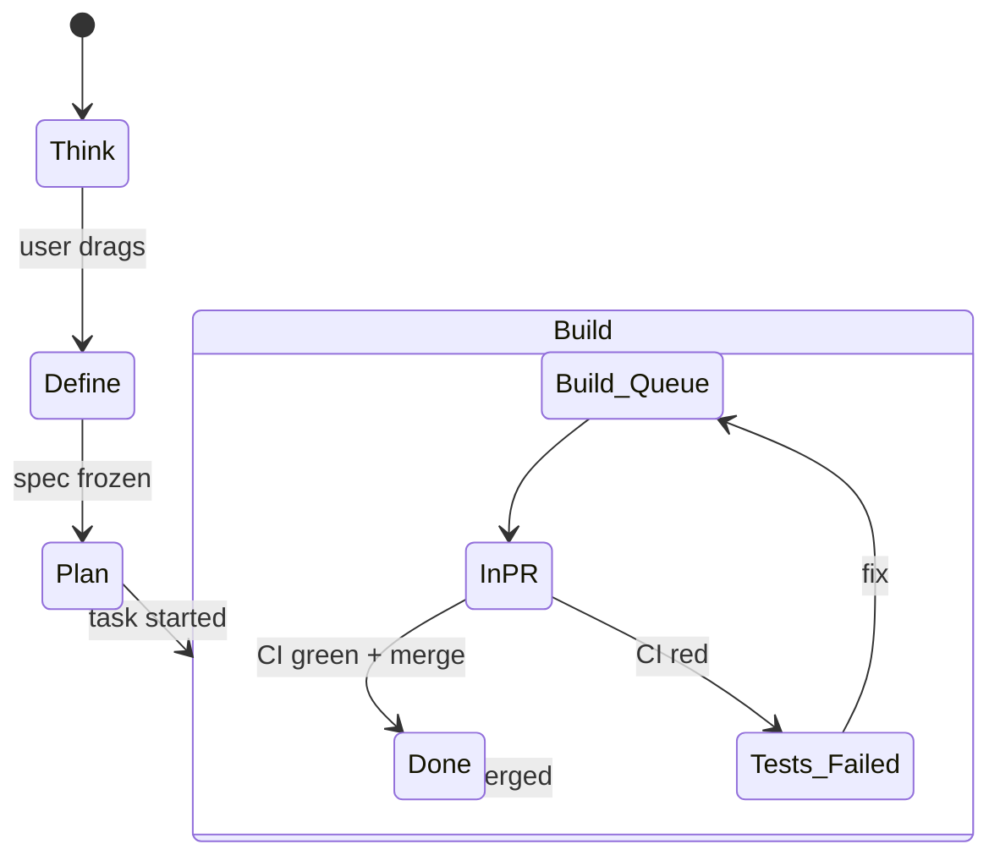
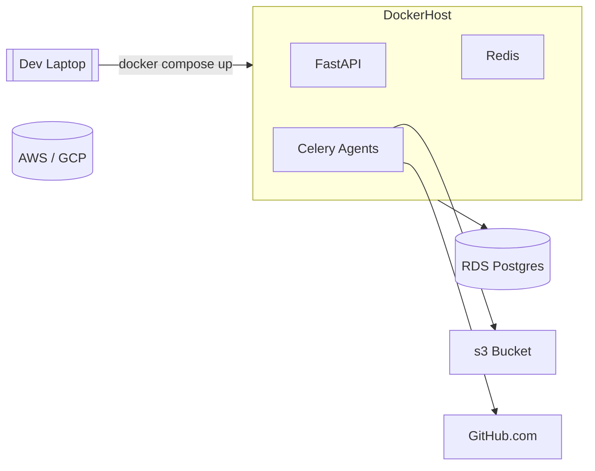

# Software-Factory – Code Flow Deep Dive 🌊

_A practical handbook for new developers (v1.0, 27 Jul 2025)_

---

## 1. Big-Picture Architecture 🏗️  

Imagine our system as a **city**:

* **Streets (Events)** – cars carry information from one place to another.  
* **Buildings (Services)** – each building has a clear job: capture ideas, write specs, create tasks, build code.  
* **Mailboxes (Redis Streams)** – every building has a mailbox where letters (events) are delivered.  
* **Citizens (Agents)** – smart robots living inside buildings; they read mail, do work, and post new letters.

### Layered Component Diagram

```mermaid
flowchart TB
    subgraph Presentation
        MCUI[Mission-Control UI<br/>(React)]
    end
    subgraph API_Layer
        FastAPI[FastAPI Gateway]
    end
    subgraph Messaging
        Redis[Redis Streams<br/>WebSocket Bridge]
    end
    subgraph Agents
        CaptureAgent
        DefineAgent
        PlannerAgent
        BuildAgent
    end
    subgraph Data
        Postgres[(PostgreSQL)]
        VectorDB[(pgvector)]
        ObjectStore[(S3 Artifacts)]
    end
    MCUI --HTTP/WS--> FastAPI
    FastAPI --publish--> Redis
    Redis --subscribe--> CaptureAgent & DefineAgent & PlannerAgent & BuildAgent
    Agents --read/write--> Postgres
    DefineAgent --embeddings--> VectorDB
    BuildAgent --binaries--> ObjectStore
    BuildAgent --GitHub PR--> GitHub[(GitHub)]
```

---

## 2. Event Life-Cycle 🔄  

1. **Born** – an HTTP call or UI action turns into an _event_ object.  
2. **Wrapped** – event is placed in a JSON envelope (see § 2.2).  
3. **Delivered** – envelope is pushed into a Redis Stream.  
4. **Consumed** – interested agent reads, locks, processes.  
5. **Replied** – agent posts follow-up events, repeating the cycle.

### 2.1 Example Timeline (Dark Mode idea)



### 2.2 Standard Envelope

```json
{
  "id": "evt_1745b3",
  "type": "idea.promoted",
  "project_id": "proj_42",
  "payload": { ... },
  "created_at": "2025-07-27T09:12:23Z",
  "actor": "ui.drag",
  "trace_id": "4bb7-b12..."
}
```

* `id` – unique; prevents double work.  
* `trace_id` – lets us follow one idea through many steps.

---

## 3. Agent Internals 🤖

| Agent | What it reads | What it writes | Key file |
|-------|---------------|---------------|----------|
| Capture | `idea.received` | `idea.captured` | `src/agents/capture_agent.py` |
| Define  | `idea.promoted` | `spec.frozen`   | `src/agents/define_agent.py` |
| Planner | `spec.frozen`   | `tasks.created` | `src/agents/planner_agent.py` |
| Build   | `task.started`  | `build.finished`, PR on GitHub | `src/agents/build_agent.py` |

All agents inherit `BaseAgent`:
```python
class BaseAgent:
    def process_event(self, event):
        with db.session():
            do_work()
            publish(new_event)
```
* Acknowledgement only after `db.commit()` to avoid lost work.  
* Retry logic lives in `agent_manager.py`.

---

## 4. Database Peek 🗄️  

### 4.1 Core Tables (simplified)

```sql
CREATE TABLE feed_item (
  id TEXT PRIMARY KEY,
  project_id TEXT,
  stage TEXT,          -- think / define / plan / build
  kind TEXT,           -- idea / spec_change / ...
  severity TEXT,
  created_at TIMESTAMP
);

CREATE TABLE specification_artifact (
  id TEXT PRIMARY KEY,
  spec_id TEXT,
  artifact_type TEXT,  -- requirements / design / tasks
  content TEXT,
  embedding VECTOR(1536)   -- for pgvector similarity
);

CREATE TABLE task (
  id TEXT PRIMARY KEY,
  spec_id TEXT,
  title TEXT,
  status TEXT,         -- ready / running / done
  owner TEXT,
  branch TEXT
);

CREATE TABLE event_log (
  id TEXT PRIMARY KEY,
  type TEXT,
  payload JSONB,
  created_at TIMESTAMP
);
```

### 4.2 Vector DB Call-out 📐  

`DefineAgent` stores a 1536-dimensional embedding for every paragraph of requirements so future ideas can **“smell”** similar specs:

```python
similar = vector_service.query(
    project_id,
    text="dark colour palette",
    k=3
)
```

---

## 5. State Machine for an Idea 🚦  



---

## 6. End-to-End Flows 🛣️  

### 6.1 Think → Define

1. UI posts `/move-to-define`  
2. Event `idea.promoted` → Redis  
3. DefineAgent:  
   * loads similar specs via pgvector  
   * drafts `requirements.md`, `design.md`, `tasks.md`  
   * writes to Postgres, emits `spec.frozen`  

### 6.2 Define → Plan

1. PlannerAgent parses `tasks.md` markdown checkboxes.  
2. Creates `task` rows with guessed owners (via `git blame`).  
3. Emits `tasks.created`.  
4. UI Kanban refreshes over WebSocket.

### 6.3 Plan → Build (happy path)

1. Developer drags card to “In Progress” → `task.started`.  
2. BuildAgent clones repo (shallow), calls Claude-Code with context files.  
3. Runs tests; on pass opens GitHub PR.  
4. Emits `build.succeeded`; UI turns card green.

---

## 7. Deployment Snapshot 🚢  



* Local dev: run everything via `docker compose`.  
* Staging/prod: same containers in EKS/GKE.

---

## 8. Getting Hands-On Quickly 🏃🏻

| Goal | Command |
|------|---------|
| Start stack | `docker compose up -d` |
| Tail events | `redis-cli xread STREAMS sf_events 0` |
| Replay missed events | `python scripts/replay_events.py` |
| Run unit tests | `pytest -q` |
| Generate vector index | `python utils/setup_vector_database.py` |

---

## 9. Cheat-Sheet 📑  

| Term | Think “plain English” |
|------|-----------------------|
| Event | A JSON postcard sent between services |
| Agent | A robot that waits for postcards, does work, sends new postcards |
| Redis Stream | The city’s postal sorting office |
| pgvector | A search engine for “sentences that feel alike” |
| Freeze Spec | “Lock the recipe so we can start cooking” |

---

### Welcome aboard!  
Clone the repo, follow an idea through the diagrams, and you’ll feel at home in no time.  
Questions? Ping us in `#factory-dev` – no question is too small. 🚀
