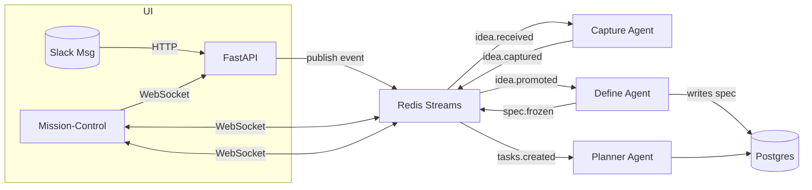
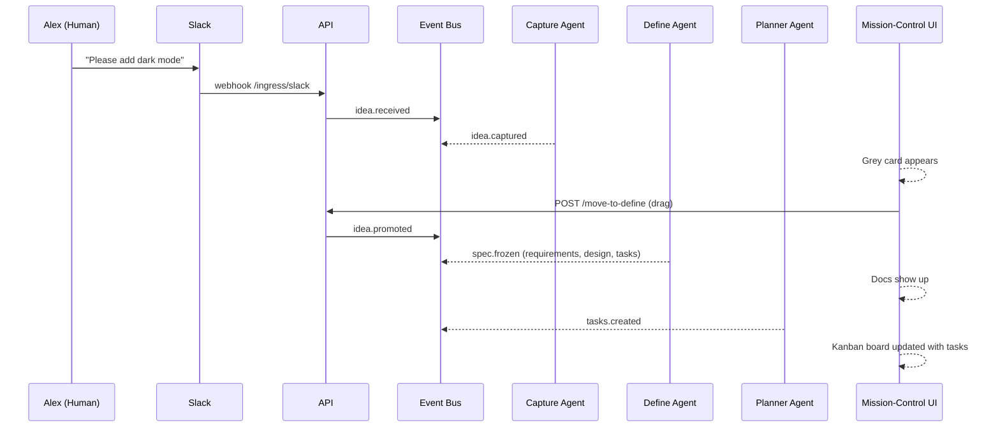

# Welcome to Software-Factory 👋  
_A quick, friendly tour of how code moves through the system_

---

## 1. Why an Event-Driven “Factory”?

Think of Software-Factory like a **smart conveyor belt** in a modern plant:

1. A new idea hops on the belt (📝 “We need Dark Mode!”).  
2. Specialized robots (we call them **agents**) pick it up, add more parts, and pass it to the next station.  
3. When the belt stops you have tested, review-ready code.

Because every station listens for a “📣 next item!” message instead of waiting in line, the whole belt runs fast and parts never get lost.  
Those messages are *events* carried over Redis/WebSockets.

---

## 2. The Three Stations You’ll Meet First

| Stage | What happens | Code lives in… |
|-------|--------------|----------------|
| **Think** | Capture raw ideas from Slack or the UI and show them as cards. | `src/agents/capture_agent.py` + React feed components |
| **Define** | The Define-Agent turns an idea into draft **requirements**, **design**, and **task list** files. | `src/agents/define_agent.py` + `/instance/…/requirements.md` etc. |
| **Plan** | The Planner-Agent reads the task list and creates real Task records that show up on a Kanban board. | `src/agents/planner_agent.py` + React board components |

Later stations **Build**, **Validate**, **Learn** follow the same pattern.

---

## 3. High-Level Flow 🗺️



*Read it left-to-right:*  
Slack fires an event ➜ agents subscribe ➜ each publishes a new event when done.

---

## 4. A Real-World Example: “Add Dark Mode” 🌙

### 4.1 Story Walk-Through

1. **Alex** writes in the project Slack:  
   > “Users keep asking for Dark Mode.”

2. **Think**  
   - Capture-Agent tags the message as an *idea* and Mission-Control shows a grey card.

3. **Define** (drag & drop)  
   - Define-Agent scans the repo, sees we use Tailwind, and drafts:  
     * Requirement: “Provide a dark colour palette toggle.”  
     * Design: lists Tailwind classes to add.  
     * tasks.md: checkbox list (add theme context, write unit tests, update docs).

4. **Plan**  
   - Planner-Agent converts each checkbox into a Task (T-101, T-102…) with suggested owners.  
   - The Kanban board now shows “Add Tailwind dark classes” ready to pick up.

5. **Next stations** will branch code, run CI, etc.—all kicked off by more events.

### 4.2 Sequence Diagram



---

## 5. Where to Look in the Code 🕵️‍♀️

| Need to understand… | Start here |
|---------------------|-----------|
| Event definitions   | `src/events/domain_events.py` |
| How agents subscribe/publish | `src/events/event_router.py` + `agents/base.py` |
| Front-end WebSocket hook | `mission-control/src/hooks/useMonitoringWebSocket.ts` |
| UI drag-and-drop | `mission-control/src/pages/MissionControl/MissionControl.tsx` |
| Database models | `src/models/…` (e.g., `task.py`, `specification_artifact.py`) |

---

## 6. Common Questions

1. **“What if Redis crashes?”**  
   Events are also logged in Postgres (`event_log` table). On restart, agents replay missed events.

2. **“Can I test an agent locally?”**  
   Run `python src/agents/example_usage.py` – it feeds a sample event to an agent.

3. **“How do I create a new agent?”**  
   Subclass `BaseAgent`, list event types, implement `process_event`, register in `agent_manager.py`.

---

## 7. Getting Hands-On

```bash
# Spin up everything
docker compose up -d

# Seed a fake 'Dark Mode' idea
curl -X POST http://localhost:8000/api/debug/seed_idea \
     -d '{"text":"Let’s build dark mode"}'
```

Refresh Mission-Control → drag the card → watch agents work!

---

### You’re Ready! 🚀  
Explore the folders above, subscribe to events, and don’t be afraid to add breakpoints.  
If something feels fuzzy, drop your question in the `#factory-dev` Slack channel.

Happy building!
