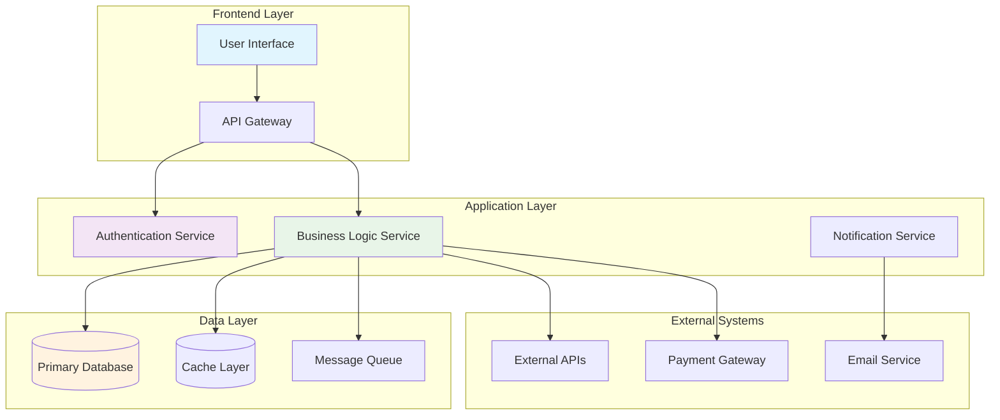
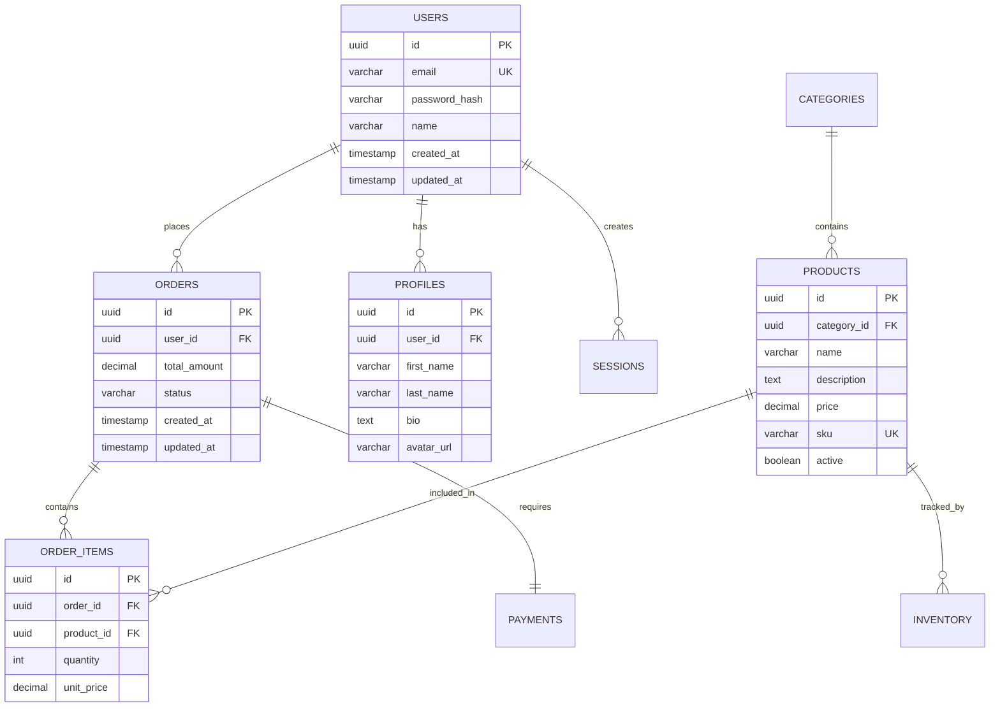
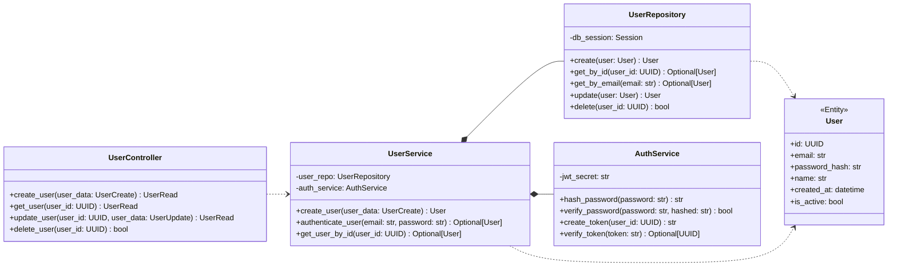

# Comprehensive PRD Template

INSTRUCTIONS FOR AI: Generate a comprehensive PRD based on the uploaded documents. Follow the structure below exactly, replacing all placeholder sections with detailed, specific content derived from the source materials. For Mermaid diagrams, generate complete, syntactically correct diagrams that visualize the described architecture and data models. Make the PRD as detailed and comprehensive as the examples in PRD1.md and PRD2.md.

## Product Specification

### Introduction & Vision
Generate a comprehensive introduction that includes:
- Clear problem statement derived from the uploaded documents
- Vision statement that describes the desired future state
- Core value proposition and benefits
- Target outcomes and impact
Base this entirely on the uploaded source materials, extracting key insights about the business problem, market opportunity, and solution approach.

### Target Audience & User Personas
Create detailed user personas including:
- Primary user types with specific characteristics
- User goals, motivations, and pain points
- User journey considerations
- Demographics and behavioral patterns
Extract user information from uploaded documents, interviews, research, or business requirements.

### User Stories / Use Cases
Generate specific, actionable user stories in the format:
- As a [user type], I want to [action] so that [benefit]
- Include acceptance criteria for each story
- Organize by user persona or feature area
- Prioritize based on business value and user impact

### Functional Requirements
Organize detailed functional requirements by feature areas:
- Core functionality with specific capabilities
- User interface requirements
- Integration requirements
- Business logic requirements
- Data management requirements
Derive these from the uploaded documents, focusing on specific features and capabilities mentioned.

### Non-Functional Requirements

#### Performance
Generate specific performance requirements with measurable metrics:
- Response time requirements (e.g., page load < 2s)
- Throughput requirements (e.g., 1000 concurrent users)
- Scalability targets
- Resource utilization limits

#### Reliability
Define reliability and availability requirements:
- Uptime targets (e.g., 99.9% availability)
- Error rate thresholds
- Disaster recovery requirements
- Backup and restore procedures

#### Security
Specify security requirements and compliance needs:
- Authentication and authorization
- Data encryption requirements
- Privacy and compliance standards
- Security audit and monitoring

#### Usability
Define usability and accessibility requirements:
- User experience standards
- Accessibility compliance (WCAG)
- Device and browser support
- Internationalization needs

### Scope

#### In Scope (MVP)
Clearly define what's included in the initial release:
- Core features and functionality
- Essential user workflows
- Key integrations
- Minimum viable capabilities

#### Out of Scope (MVP)
Define what's excluded from initial release:
- Advanced features for future releases
- Nice-to-have functionality
- Complex integrations
- Performance optimizations

### Success Metrics
Generate KPIs and success measurements:
- Business metrics (revenue, conversion, retention)
- User engagement metrics
- Technical performance metrics
- Operational efficiency metrics

### Assumptions & Dependencies
Identify key assumptions and external dependencies:
- Technology assumptions
- Resource availability
- Third-party integrations
- Market conditions
- User behavior assumptions

### Risks and Mitigations
Identify potential risks and mitigation strategies:
- Technical risks and solutions
- Business risks and contingencies
- Resource risks and alternatives
- Market risks and responses

## Technical Specification

### System Overview
Generate a comprehensive technical architecture overview including:
- High-level system description
- Key architectural decisions
- Technology stack rationale
- Integration approach
- Deployment model

### Architectural Drivers

#### Goals
Define specific technical goals and objectives:
- Performance targets
- Scalability requirements
- Maintainability goals
- Security objectives
- Cost optimization targets

#### Constraints
Identify technical constraints and limitations:
- Technology limitations
- Resource constraints
- Timeline constraints
- Compliance requirements
- Legacy system constraints

### High-Level Architecture
Generate system architecture description including:
- System components and their relationships
- Data flow between components
- External system integrations
- Communication protocols
- Deployment architecture

#### Components Diagram


### Data Architecture and Models
Generate data model descriptions including:
- Data entities and relationships
- Data flow patterns
- Storage requirements
- Data consistency requirements
- Backup and recovery strategy

#### Entity Relationship Diagram (ERD)


#### Data Models (Pydantic/TypeScript)
```python
from pydantic import BaseModel, EmailStr, Field
from typing import Optional, List
from datetime import datetime
from uuid import UUID

class UserBase(BaseModel):
    email: EmailStr
    name: str

class UserCreate(UserBase):
    password: str

class UserRead(UserBase):
    id: UUID
    created_at: datetime
    is_active: bool
    
    class Config:
        orm_mode = True

class ProductBase(BaseModel):
    name: str = Field(..., min_length=1, max_length=200)
    description: str
    price: float = Field(..., gt=0)
    sku: str = Field(..., min_length=1)

class ProductCreate(ProductBase):
    category_id: UUID

class ProductRead(ProductBase):
    id: UUID
    category_id: UUID
    created_at: datetime
    is_active: bool
    
    class Config:
        orm_mode = True
```

### Component Blueprint & Class Diagram
Generate component architecture details including:
- Service layer organization
- Component responsibilities
- Interface definitions
- Dependency relationships
- Design patterns used

#### Class Diagram


### User Interface / User Experience Key Requirements
Generate detailed UI/UX specifications including:
- Design system requirements
- User interface patterns
- Responsive design requirements
- Accessibility standards
- User workflow specifications

### Mathematical Specifications and Formulas
Generate performance formulas and calculations where applicable:
- Load calculation formulas
- Performance metrics equations
- Capacity planning formulas
- Cost optimization calculations

### Security and RBAC
Generate security architecture and role-based access control:
- Authentication mechanisms
- Authorization models
- Role definitions and permissions
- Security audit requirements
- Data protection measures

### DevOps Requirements
Generate deployment and infrastructure requirements:
- Containerization strategy
- CI/CD pipeline requirements
- Monitoring and logging
- Infrastructure as code
- Scaling strategies

### Implementation, Validation and Verification Strategy
Generate testing and validation approaches:
- Unit testing strategy
- Integration testing approach
- Performance testing requirements
- Security testing protocols
- User acceptance testing criteria

## Implementation Plan

### Phase-by-Phase Development
Break down implementation into logical phases:
- Phase 1: Core functionality and MVP features
- Phase 2: Enhanced features and integrations
- Phase 3: Advanced features and optimizations
- Each phase should include specific deliverables and success criteria

### Files Tree Structure
Generate a comprehensive file structure for the project:
```
project-root/
├── backend/
│   ├── app/
│   │   ├── api/
│   │   │   ├── routes/
│   │   │   │   ├── users.py
│   │   │   │   ├── products.py
│   │   │   │   └── orders.py
│   │   │   └── dependencies.py
│   │   ├── core/
│   │   │   ├── config.py
│   │   │   ├── database.py
│   │   │   └── security.py
│   │   ├── models/
│   │   │   ├── user.py
│   │   │   ├── product.py
│   │   │   └── order.py
│   │   ├── services/
│   │   │   ├── user_service.py
│   │   │   ├── product_service.py
│   │   │   └── order_service.py
│   │   └── main.py
│   ├── tests/
│   ├── requirements.txt
│   └── Dockerfile
├── frontend/
│   ├── src/
│   │   ├── components/
│   │   ├── pages/
│   │   ├── services/
│   │   ├── store/
│   │   └── types/
│   ├── public/
│   ├── package.json
│   └── Dockerfile
├── docker-compose.yml
├── .github/
│   └── workflows/
└── README.md
```

## Files Tree
[AI will generate comprehensive file structure]

## Implementation Plan
[AI will generate phased implementation approach]

### Phase 1: [Phase Name]
[AI will generate detailed phase descriptions with tasks and deliverables]

### Phase 2: [Phase Name]
[AI will continue with subsequent phases]